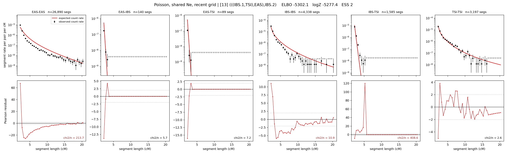

# `(((IBS.1,TSI),EAS),IBS.2)`

**Poisson, shared Ne, recent grid** | topology 13 of 21 | admixed leaf: **IBS** | 4 events, 8 nodes

> Recent Ne grid: 0-5 and 5-10 generations. The first demographic event is explicitly constrained to occur after generation 10 (minimum 11 with the current one-generation gap).

## Model score

| quantity | value | |
|---|---|---|
| ELBO | -5302.08 | +- 0.36 (MC) |
| logZ (importance sampling) | -5277.39 | |
| ESS of the IS weights | 1.7 / 4000 | LOW -- treat logZ with suspicion |
| Stan dropped-constant correction | -29.61 | already applied |
| seed kept / runtime | 1 | 23 s |

## Events (in temporal order, most recent first)

| # | type | detail | time (gen) | cumulative |
|---|---|---|---|---|
| 1 | ADMIXTURE | IBS -> IBS.1 + IBS.2 | 242.8 +- 0.9 | 242.8 |
| 2 | MERGE | IBS.2 + TSI -> n1 | 1.0 +- 0.0 | 243.8 |
| 3 | MERGE | n1 + EAS -> n2 | 124.9 +- 1.2 | 368.7 |
| 4 | MERGE | IBS.1 + n2 -> root | 1.0 +- 0.0 | 369.7 |

## Admixture fraction

**f = 0.001 +- 0.000** (fraction from `IBS.1`; 0.999 from `IBS.2`)

Collapsed to a tree: one source carries <5% of the ancestry, so this graph is behaving as its no-admixture special case.

## Recent effective sizes shared by IBD and SNP (haploid)

| population | 0-5 gen | 5-10 gen |
|---|---:|---:|
| `EAS` | 79,037,574 | 34,245,058 |
| `IBS` | 2,684,317 | 1,739,789 |
| `TSI` | 780,188 | 649,715 |

## Effective sizes shared by IBD and SNP (haploid)

| node | Ne | sd of log Ne |
|---|---|---|
| `EAS` | 829,872 | 0.03 |
| `IBS` | 298,859 | 0.06 |
| `TSI` | 406,741 | 0.05 |
| `IBS.1` | 91 | 0.01 |
| `IBS.2` | 729 | 0.01 |
| `n1` | 694 | 0.01 |
| `n2` | 138 | 0.01 |
| `root` | 112 | 0.01 |

log-Ne random-walk step scale tau = 2.739

## Fit quality by component

| component | log-likelihood | n terms | chi2/n |
|---|---|---|---|
| IBD | -5,079.5 | 222 | 108.86 |
| SNP | +39.2 | 6 | 1.46 |

IBD chi2/n uses Poisson counting variance; SNP chi2/n uses its block SEs. Values near 1 indicate residuals on the modeled noise scale.

## SNP covariance residuals `(w_hat - W_pred)/w_se`

| | EAS | IBS | TSI |
|---|---|---|---|
| **EAS** | +0.13 | +0.46 | -0.71 |
| **IBS** | +0.46 | -1.04 | +0.18 |
| **TSI** | -0.71 | +0.18 | +1.19 |

