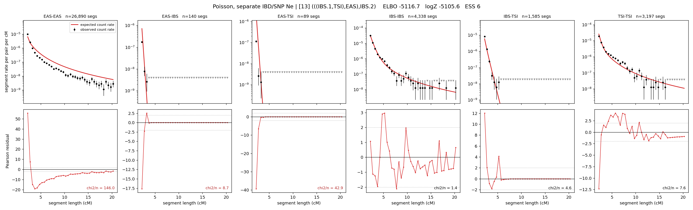

# `(((IBS.1,TSI),EAS),IBS.2)`

**Poisson, separate IBD/SNP Ne** | topology 13 of 21 | admixed leaf: **IBS** | 4 events, 8 nodes

## Model score

| quantity | value | |
|---|---|---|
| ELBO | -5116.65 | +- 0.12 (MC) |
| logZ (importance sampling) | -5105.64 | |
| ESS of the IS weights | 5.5 / 4000 | LOW -- treat logZ with suspicion |
| Stan dropped-constant correction | -29.78 | already applied |
| mode kept / MAP start / runtime | 2 / 2 | 20 s |
| mode search | 12/12 MAP starts succeeded | 3 distinct modes evaluated |

## Events (in temporal order, most recent first)

| # | type | detail | time (gen) | cumulative |
|---|---|---|---|---|
| 1 | ADMIXTURE | IBS -> IBS.1 + IBS.2 | 75.2 +- 0.2 | 75.2 |
| 2 | MERGE | IBS.2 + TSI -> n1 | 46.6 +- 0.1 | 121.8 |
| 3 | MERGE | n1 + EAS -> n2 | 223.3 +- 1.6 | 345.1 |
| 4 | MERGE | IBS.1 + n2 -> root | 154.7 +- 0.3 | 499.7 |

## Admixture fraction

**f = 0.683 +- 0.006** (fraction from `IBS.1`; 0.317 from `IBS.2`)

## Effective sizes for IBD (haploid)

| node | Ne | sd of log Ne |
|---|---|---|
| `EAS` | 1,070,714 | 0.01 |
| `IBS` | 919,374 | 0.03 |
| `TSI` | 554,390 | 0.03 |
| `IBS.1` | 28,178 | 0.03 |
| `IBS.2` | 4,684,263 | 0.02 |
| `n1` | 26,583 | 0.01 |
| `n2` | 54 | 0.01 |
| `root` | 576 | 0.00 |

log-Ne random-walk step scale tau_ibd = 2.021

## Effective sizes for SNP (haploid)

| node | Ne | sd of log Ne |
|---|---|---|
| `EAS` | 1,911 | 0.01 |
| `IBS` | 516,689 | 0.02 |
| `TSI` | 1,166,520 | 0.02 |
| `IBS.1` | 374,193 | 0.03 |
| `IBS.2` | 670,017 | 0.02 |
| `n1` | 505,503 | 0.02 |
| `n2` | 63,295 | 0.00 |
| `root` | 36,757 | 0.00 |

log-Ne random-walk step scale tau_snp = 1.407

## Fit quality by component

| component | log-likelihood | n terms | chi2/n |
|---|---|---|---|
| IBD | -4,924.0 | 222 | 35.26 |
| SNP | +39.7 | 6 | 1.30 |

IBD chi2/n uses Poisson counting variance; SNP chi2/n uses its block SEs. Values near 1 indicate residuals on the modeled noise scale.

## SNP covariance residuals `(w_hat - W_pred)/w_se`

| | EAS | IBS | TSI |
|---|---|---|---|
| **EAS** | -0.10 | +0.80 | -0.60 |
| **IBS** | +0.80 | -0.62 | -0.96 |
| **TSI** | -0.60 | -0.96 | +2.04 |

