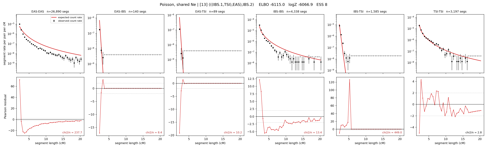

# `(((IBS.1,TSI),EAS),IBS.2)`

**Poisson, shared Ne** | topology 13 of 21 | admixed leaf: **IBS** | 4 events, 8 nodes

## Model score

| quantity | value | |
|---|---|---|
| ELBO | -6114.96 | +- 0.84 (MC) |
| logZ (importance sampling) | -6066.88 | |
| ESS of the IS weights | 8.4 / 4000 | LOW -- treat logZ with suspicion |
| Stan dropped-constant correction | -24.10 | already applied |
| seed kept / runtime | 7 | 17 s |

## Events (in temporal order, most recent first)

| # | type | detail | time (gen) | cumulative |
|---|---|---|---|---|
| 1 | ADMIXTURE | IBS -> IBS.1 + IBS.2 | 244.7 +- 1.2 | 244.7 |
| 2 | MERGE | IBS.2 + TSI -> n1 | 1.0 +- 0.0 | 245.7 |
| 3 | MERGE | n1 + EAS -> n2 | 114.6 +- 0.5 | 360.3 |
| 4 | MERGE | IBS.1 + n2 -> root | 1.0 +- 0.0 | 361.3 |

## Admixture fraction

**f = 0.000 +- 0.000** (fraction from `IBS.1`; 1.000 from `IBS.2`)

Collapsed to a tree: one source carries <5% of the ancestry, so this graph is behaving as its no-admixture special case.

## Effective sizes shared by IBD and SNP (haploid)

| node | Ne | sd of log Ne |
|---|---|---|
| `EAS` | 894,255 | 0.03 |
| `IBS` | 317,822 | 0.05 |
| `TSI` | 418,808 | 0.06 |
| `IBS.1` | 108 | 0.02 |
| `IBS.2` | 676 | 0.02 |
| `n1` | 638 | 0.02 |
| `n2` | 142 | 0.02 |
| `root` | 123 | 0.02 |

log-Ne random-walk step scale tau = 1.487

## Fit quality by component

| component | log-likelihood | n terms | chi2/n |
|---|---|---|---|
| IBD | -5,793.6 | 222 | 121.14 |
| SNP | +13.4 | 6 | 10.07 |

IBD chi2/n uses Poisson counting variance; SNP chi2/n uses its block SEs. Values near 1 indicate residuals on the modeled noise scale.

## SNP covariance residuals `(w_hat - W_pred)/w_se`

| | EAS | IBS | TSI |
|---|---|---|---|
| **EAS** | +0.07 | +0.79 | -0.94 |
| **IBS** | +0.79 | -1.75 | +0.26 |
| **TSI** | -0.94 | +0.26 | +1.54 |

