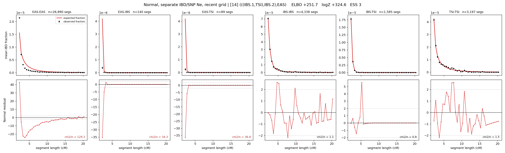

# `(((IBS.1,TSI),IBS.2),EAS)`

**Normal, separate IBD/SNP Ne, recent grid** | topology 14 of 21 | admixed leaf: **IBS** | 4 events, 8 nodes

> Recent Ne grid: 0-5 and 5-10 generations. The first demographic event is explicitly constrained to occur after generation 10 (minimum 11 with the current one-generation gap).

## Model score

| quantity | value | |
|---|---|---|
| ELBO | +251.74 | +- 0.98 (MC) |
| logZ (importance sampling) | +324.59 | |
| ESS of the IS weights | 3.3 / 4000 | LOW -- treat logZ with suspicion |
| Stan dropped-constant correction | -40.81 | already applied |
| seed kept / runtime | 1 | 24 s |

## Events (in temporal order, most recent first)

| # | type | detail | time (gen) | cumulative |
|---|---|---|---|---|
| 1 | ADMIXTURE | IBS -> IBS.1 + IBS.2 | 78.7 +- 1.0 | 78.7 |
| 2 | MERGE | IBS.2 + TSI -> n1 | 55.8 +- 1.1 | 134.5 |
| 3 | MERGE | IBS.1 + n1 -> n2 | 96.3 +- 3.5 | 230.8 |
| 4 | MERGE | n2 + EAS -> root | 132.2 +- 8.7 | 363.0 |

## Admixture fraction

**f = 0.035 +- 0.004** (fraction from `IBS.1`; 0.965 from `IBS.2`)

Collapsed to a tree: one source carries <5% of the ancestry, so this graph is behaving as its no-admixture special case.

## Recent effective sizes for IBD (haploid)

| population | 0-5 gen | 5-10 gen |
|---|---:|---:|
| `EAS` | 33,483,152 | 20,505,453 |
| `IBS` | 2,328,802 | 1,816,987 |
| `TSI` | 1,538,528 | 1,071,256 |

## Effective sizes for IBD (haploid)

| node | Ne | sd of log Ne |
|---|---|---|
| `EAS` | 874,428 | 0.06 |
| `IBS` | 789,474 | 0.10 |
| `TSI` | 387,040 | 0.08 |
| `IBS.1` | 40,535 | 0.52 |
| `IBS.2` | 54,094 | 0.08 |
| `n1` | 44,949 | 0.07 |
| `n2` | 154,935 | 0.76 |
| `root` | 22 | 0.33 |

log-Ne random-walk step scale tau_ibd = 2.206

## Recent effective sizes for SNP (haploid)

| population | 0-5 gen | 5-10 gen |
|---|---:|---:|
| `EAS` | 3,375 | 3,207 |
| `IBS` | 116,979 | 115,750 |
| `TSI` | 153,728 | 150,050 |

## Effective sizes for SNP (haploid)

| node | Ne | sd of log Ne |
|---|---|---|
| `EAS` | 2,666 | 0.14 |
| `IBS` | 112,411 | 0.17 |
| `TSI` | 140,860 | 0.48 |
| `IBS.1` | 10,399 | 0.10 |
| `IBS.2` | 77,249 | 0.13 |
| `n1` | 42,364 | 0.02 |
| `n2` | 3,772 | 0.40 |
| `root` | 12,436 | 0.06 |

log-Ne random-walk step scale tau_snp = 0.681

## Fit quality by component

| component | log-likelihood | n terms | chi2/n |
|---|---|---|---|
| IBD | +547.7 | 222 | 34.42 |
| SNP | +35.5 | 6 | 2.71 |

IBD chi2/n uses Palamara model-derived Normal variance; SNP chi2/n uses its block SEs. Values near 1 indicate residuals on the modeled noise scale.

## SNP covariance residuals `(w_hat - W_pred)/w_se`

| | EAS | IBS | TSI |
|---|---|---|---|
| **EAS** | -0.02 | +0.11 | -0.07 |
| **IBS** | +0.11 | -0.08 | -0.15 |
| **TSI** | -0.07 | -0.15 | +0.27 |

