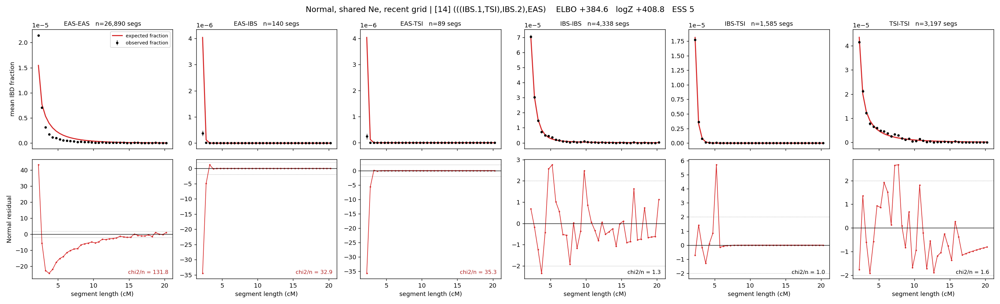

# `(((IBS.1,TSI),IBS.2),EAS)`

**Normal, shared Ne, recent grid** | topology 14 of 21 | admixed leaf: **IBS** | 4 events, 8 nodes

> Recent Ne grid: 0-5 and 5-10 generations. The first demographic event is explicitly constrained to occur after generation 10 (minimum 11 with the current one-generation gap).

## Model score

| quantity | value | |
|---|---|---|
| ELBO | +384.58 | +- 0.33 (MC) |
| logZ (importance sampling) | +408.80 | |
| ESS of the IS weights | 4.7 / 4000 | LOW -- treat logZ with suspicion |
| Stan dropped-constant correction | -29.61 | already applied |
| seed kept / runtime | 1 | 23 s |

## Events (in temporal order, most recent first)

| # | type | detail | time (gen) | cumulative |
|---|---|---|---|---|
| 1 | ADMIXTURE | IBS -> IBS.1 + IBS.2 | 66.8 +- 2.1 | 66.8 |
| 2 | MERGE | IBS.2 + TSI -> n1 | 66.9 +- 2.3 | 133.6 |
| 3 | MERGE | IBS.1 + n1 -> n2 | 208.8 +- 1.0 | 342.4 |
| 4 | MERGE | n2 + EAS -> root | 11.7 +- 0.3 | 354.1 |

## Admixture fraction

**f = 0.132 +- 0.002** (fraction from `IBS.1`; 0.868 from `IBS.2`)

## Recent effective sizes shared by IBD and SNP (haploid)

| population | 0-5 gen | 5-10 gen |
|---|---:|---:|
| `EAS` | 81,513,058 | 36,345,543 |
| `IBS` | 1,810,255 | 1,533,812 |
| `TSI` | 1,239,862 | 907,176 |

## Effective sizes shared by IBD and SNP (haploid)

| node | Ne | sd of log Ne |
|---|---|---|
| `EAS` | 866,520 | 0.02 |
| `IBS` | 950,592 | 0.10 |
| `TSI` | 396,812 | 0.08 |
| `IBS.1` | 3,288 | 0.10 |
| `IBS.2` | 112,234 | 0.04 |
| `n1` | 45,190 | 0.04 |
| `n2` | 66 | 0.03 |
| `root` | 42 | 0.05 |

log-Ne random-walk step scale tau = 2.216

## Fit quality by component

| component | log-likelihood | n terms | chi2/n |
|---|---|---|---|
| IBD | +581.9 | 222 | 34.11 |
| SNP | +35.3 | 6 | 2.77 |

IBD chi2/n uses Palamara model-derived Normal variance; SNP chi2/n uses its block SEs. Values near 1 indicate residuals on the modeled noise scale.

## SNP covariance residuals `(w_hat - W_pred)/w_se`

| | EAS | IBS | TSI |
|---|---|---|---|
| **EAS** | -0.15 | +0.46 | -0.17 |
| **IBS** | +0.46 | -0.30 | -0.62 |
| **TSI** | -0.17 | -0.62 | +0.91 |

