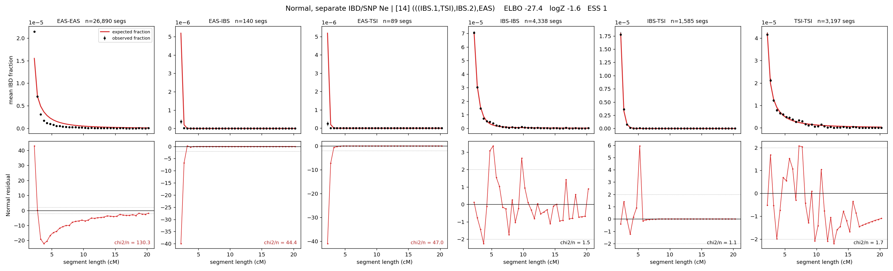

# `(((IBS.1,TSI),IBS.2),EAS)`

**Normal, separate IBD/SNP Ne** | topology 14 of 21 | admixed leaf: **IBS** | 4 events, 8 nodes

## Model score

| quantity | value | |
|---|---|---|
| ELBO | -27.36 | +- 0.28 (MC) |
| logZ (importance sampling) | -1.55 | |
| ESS of the IS weights | 1.4 / 4000 | LOW -- treat logZ with suspicion |
| Stan dropped-constant correction | -29.78 | already applied |
| mode kept / MAP start / runtime | 2 / 7 | 22 s |
| mode search | 12/12 MAP starts succeeded | 3 distinct modes evaluated |

## Events (in temporal order, most recent first)

| # | type | detail | time (gen) | cumulative |
|---|---|---|---|---|
| 1 | ADMIXTURE | IBS -> IBS.1 + IBS.2 | 66.3 +- 0.8 | 66.3 |
| 2 | MERGE | IBS.2 + TSI -> n1 | 65.3 +- 0.8 | 131.6 |
| 3 | MERGE | IBS.1 + n1 -> n2 | 3.5 +- 0.1 | 135.1 |
| 4 | MERGE | n2 + EAS -> root | 194.0 +- 1.2 | 329.1 |

## Admixture fraction

**f = 0.999 +- 0.000** (fraction from `IBS.1`; 0.001 from `IBS.2`)

Collapsed to a tree: one source carries <5% of the ancestry, so this graph is behaving as its no-admixture special case.

## Effective sizes for IBD (haploid)

| node | Ne | sd of log Ne |
|---|---|---|
| `EAS` | 969,689 | 0.02 |
| `IBS` | 1,136,145 | 0.05 |
| `TSI` | 403,380 | 0.07 |
| `IBS.1` | 78,217 | 0.03 |
| `IBS.2` | 44,757 | 0.03 |
| `n1` | 67,463 | 0.03 |
| `n2` | 49,258 | 0.03 |
| `root` | 108 | 0.01 |

log-Ne random-walk step scale tau_ibd = 1.618

## Effective sizes for SNP (haploid)

| node | Ne | sd of log Ne |
|---|---|---|
| `EAS` | 1,847 | 0.01 |
| `IBS` | 118,536 | 0.04 |
| `TSI` | 94,884 | 0.04 |
| `IBS.1` | 100,683 | 0.04 |
| `IBS.2` | 114,409 | 0.04 |
| `n1` | 95,698 | 0.04 |
| `n2` | 88,510 | 0.04 |
| `root` | 9,917 | 0.01 |

log-Ne random-walk step scale tau_snp = 0.690

## Fit quality by component

| component | log-likelihood | n terms | chi2/n |
|---|---|---|---|
| IBD | +152.4 | 222 | 37.79 |
| SNP | +37.8 | 6 | 1.94 |

IBD chi2/n uses Palamara model-derived Normal variance; SNP chi2/n uses its block SEs. Values near 1 indicate residuals on the modeled noise scale.

## SNP covariance residuals `(w_hat - W_pred)/w_se`

| | EAS | IBS | TSI |
|---|---|---|---|
| **EAS** | +0.04 | -0.06 | -0.01 |
| **IBS** | -0.06 | +0.15 | -0.02 |
| **TSI** | -0.01 | -0.02 | +0.05 |

