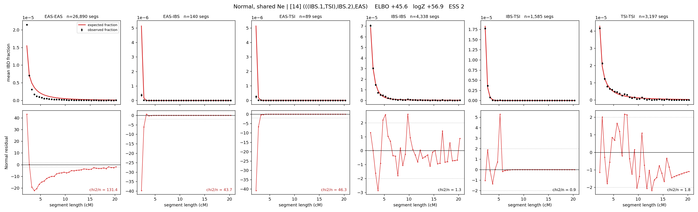

# `(((IBS.1,TSI),IBS.2),EAS)`

**Normal, shared Ne** | topology 14 of 21 | admixed leaf: **IBS** | 4 events, 8 nodes

## Model score

| quantity | value | |
|---|---|---|
| ELBO | +45.61 | +- 0.15 (MC) |
| logZ (importance sampling) | +56.88 | |
| ESS of the IS weights | 2.5 / 4000 | LOW -- treat logZ with suspicion |
| Stan dropped-constant correction | -24.10 | already applied |
| mode kept / MAP start / runtime | 1 / 3 | 19 s |
| mode search | 12/12 MAP starts succeeded | 3 distinct modes evaluated |

## Events (in temporal order, most recent first)

| # | type | detail | time (gen) | cumulative |
|---|---|---|---|---|
| 1 | ADMIXTURE | IBS -> IBS.1 + IBS.2 | 57.9 +- 0.3 | 57.9 |
| 2 | MERGE | IBS.2 + TSI -> n1 | 71.9 +- 0.2 | 129.8 |
| 3 | MERGE | IBS.1 + n1 -> n2 | 211.8 +- 0.6 | 341.6 |
| 4 | MERGE | n2 + EAS -> root | 6.1 +- 0.0 | 347.7 |

## Admixture fraction

**f = 0.141 +- 0.001** (fraction from `IBS.1`; 0.859 from `IBS.2`)

## Effective sizes shared by IBD and SNP (haploid)

| node | Ne | sd of log Ne |
|---|---|---|
| `EAS` | 966,603 | 0.01 |
| `IBS` | 1,131,682 | 0.04 |
| `TSI` | 408,536 | 0.03 |
| `IBS.1` | 2,209 | 0.03 |
| `IBS.2` | 2,579,049 | 0.03 |
| `n1` | 54,866 | 0.02 |
| `n2` | 35 | 0.01 |
| `root` | 42 | 0.01 |

log-Ne random-walk step scale tau = 1.429

## Fit quality by component

| component | log-likelihood | n terms | chi2/n |
|---|---|---|---|
| IBD | +170.1 | 222 | 37.63 |
| SNP | +39.0 | 6 | 1.53 |

IBD chi2/n uses Palamara model-derived Normal variance; SNP chi2/n uses its block SEs. Values near 1 indicate residuals on the modeled noise scale.

## SNP covariance residuals `(w_hat - W_pred)/w_se`

| | EAS | IBS | TSI |
|---|---|---|---|
| **EAS** | +0.06 | +0.63 | -0.75 |
| **IBS** | +0.63 | -1.70 | +0.53 |
| **TSI** | -0.75 | +0.53 | +0.94 |

