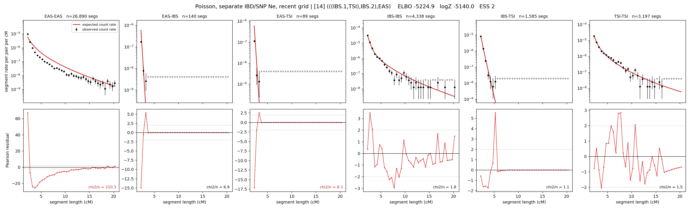

# `(((IBS.1,TSI),IBS.2),EAS)`

**Poisson, separate IBD/SNP Ne, recent grid** | topology 14 of 21 | admixed leaf: **IBS** | 4 events, 8 nodes

> Recent Ne grid: 0-5 and 5-10 generations. The first demographic event is explicitly constrained to occur after generation 10 (minimum 11 with the current one-generation gap).

## Model score

| quantity | value | |
|---|---|---|
| ELBO | -5224.87 | +- 1.27 (MC) |
| logZ (importance sampling) | -5139.97 | |
| ESS of the IS weights | 2.3 / 4000 | LOW -- treat logZ with suspicion |
| Stan dropped-constant correction | -40.81 | already applied |
| seed kept / runtime | 13 | 23 s |

## Events (in temporal order, most recent first)

| # | type | detail | time (gen) | cumulative |
|---|---|---|---|---|
| 1 | ADMIXTURE | IBS -> IBS.1 + IBS.2 | 141.7 +- 4.2 | 141.7 |
| 2 | MERGE | IBS.2 + TSI -> n1 | 1.0 +- 0.0 | 142.7 |
| 3 | MERGE | IBS.1 + n1 -> n2 | 1.0 +- 0.0 | 143.7 |
| 4 | MERGE | n2 + EAS -> root | 266.4 +- 4.0 | 410.1 |

## Admixture fraction

**f = 0.021 +- 0.000** (fraction from `IBS.1`; 0.979 from `IBS.2`)

Collapsed to a tree: one source carries <5% of the ancestry, so this graph is behaving as its no-admixture special case.

## Recent effective sizes for IBD (haploid)

| population | 0-5 gen | 5-10 gen |
|---|---:|---:|
| `EAS` | 163,169,079 | 122,687,593 |
| `IBS` | 19,476,986 | 12,218,655 |
| `TSI` | 2,905,571 | 1,609,337 |

## Effective sizes for IBD (haploid)

| node | Ne | sd of log Ne |
|---|---|---|
| `EAS` | 835,773 | 0.05 |
| `IBS` | 495,874 | 0.09 |
| `TSI` | 390,146 | 0.07 |
| `IBS.1` | 36,755 | 0.14 |
| `IBS.2` | 478 | 0.12 |
| `n1` | 4,073 | 0.13 |
| `n2` | 37,108 | 0.14 |
| `root` | 1 | 0.18 |

log-Ne random-walk step scale tau_ibd = 4.007

## Recent effective sizes for SNP (haploid)

| population | 0-5 gen | 5-10 gen |
|---|---:|---:|
| `EAS` | 987 | 1,174 |
| `IBS` | 42,421 | 47,448 |
| `TSI` | 328,958 | 356,774 |

## Effective sizes for SNP (haploid)

| node | Ne | sd of log Ne |
|---|---|---|
| `EAS` | 2,533 | 0.02 |
| `IBS` | 80,544 | 0.04 |
| `TSI` | 441,850 | 0.05 |
| `IBS.1` | 20,052 | 0.03 |
| `IBS.2` | 21,522 | 0.03 |
| `n1` | 20,721 | 0.03 |
| `n2` | 20,091 | 0.03 |
| `root` | 363,746 | 0.02 |

log-Ne random-walk step scale tau_snp = 0.836

## Fit quality by component

| component | log-likelihood | n terms | chi2/n |
|---|---|---|---|
| IBD | -4,742.0 | 222 | 38.82 |
| SNP | +23.5 | 6 | 6.69 |

IBD chi2/n uses Poisson counting variance; SNP chi2/n uses its block SEs. Values near 1 indicate residuals on the modeled noise scale.

## SNP covariance residuals `(w_hat - W_pred)/w_se`

| | EAS | IBS | TSI |
|---|---|---|---|
| **EAS** | -0.11 | +0.93 | -0.71 |
| **IBS** | +0.93 | -1.00 | -0.82 |
| **TSI** | -0.71 | -0.82 | +2.13 |

