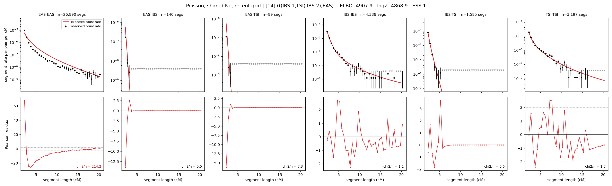

# `(((IBS.1,TSI),IBS.2),EAS)`

**Poisson, shared Ne, recent grid** | topology 14 of 21 | admixed leaf: **IBS** | 4 events, 8 nodes

> Recent Ne grid: 0-5 and 5-10 generations. The first demographic event is explicitly constrained to occur after generation 10 (minimum 11 with the current one-generation gap).

## Model score

| quantity | value | |
|---|---|---|
| ELBO | -4907.88 | +- 0.63 (MC) |
| logZ (importance sampling) | -4868.94 | |
| ESS of the IS weights | 1.2 / 4000 | LOW -- treat logZ with suspicion |
| Stan dropped-constant correction | -29.61 | already applied |
| mode kept / MAP start / runtime | 1 / 3 | 26 s |
| mode search | 12/12 MAP starts succeeded | 3 distinct modes evaluated |

## Events (in temporal order, most recent first)

| # | type | detail | time (gen) | cumulative |
|---|---|---|---|---|
| 1 | ADMIXTURE | IBS -> IBS.1 + IBS.2 | 86.1 +- 1.0 | 86.1 |
| 2 | MERGE | IBS.2 + TSI -> n1 | 29.9 +- 0.9 | 116.0 |
| 3 | MERGE | IBS.1 + n1 -> n2 | 186.8 +- 1.4 | 302.8 |
| 4 | MERGE | n2 + EAS -> root | 25.0 +- 0.2 | 327.8 |

## Admixture fraction

**f = 0.025 +- 0.001** (fraction from `IBS.1`; 0.975 from `IBS.2`)

Collapsed to a tree: one source carries <5% of the ancestry, so this graph is behaving as its no-admixture special case.

## Recent effective sizes shared by IBD and SNP (haploid)

| population | 0-5 gen | 5-10 gen |
|---|---:|---:|
| `EAS` | 59,943,784 | 32,404,174 |
| `IBS` | 1,461,632 | 1,416,637 |
| `TSI` | 1,642,728 | 1,070,721 |

## Effective sizes shared by IBD and SNP (haploid)

| node | Ne | sd of log Ne |
|---|---|---|
| `EAS` | 832,717 | 0.03 |
| `IBS` | 773,797 | 0.06 |
| `TSI` | 378,387 | 0.06 |
| `IBS.1` | 127 | 0.08 |
| `IBS.2` | 43,569 | 0.06 |
| `n1` | 114,313 | 0.05 |
| `n2` | 140 | 0.01 |
| `root` | 607 | 0.02 |

log-Ne random-walk step scale tau = 2.379

## Fit quality by component

| component | log-likelihood | n terms | chi2/n |
|---|---|---|---|
| IBD | -4,720.5 | 222 | 38.62 |
| SNP | +35.4 | 6 | 2.74 |

IBD chi2/n uses Poisson counting variance; SNP chi2/n uses its block SEs. Values near 1 indicate residuals on the modeled noise scale.

## SNP covariance residuals `(w_hat - W_pred)/w_se`

| | EAS | IBS | TSI |
|---|---|---|---|
| **EAS** | -0.11 | +0.88 | -0.67 |
| **IBS** | +0.88 | -0.79 | -0.95 |
| **TSI** | -0.67 | -0.95 | +2.17 |

