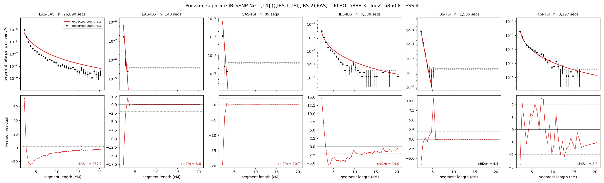

# `(((IBS.1,TSI),IBS.2),EAS)`

**Poisson, separate IBD/SNP Ne** | topology 14 of 21 | admixed leaf: **IBS** | 4 events, 8 nodes

## Model score

| quantity | value | |
|---|---|---|
| ELBO | -5888.32 | +- 0.63 (MC) |
| logZ (importance sampling) | -5850.76 | |
| ESS of the IS weights | 3.8 / 4000 | LOW -- treat logZ with suspicion |
| Stan dropped-constant correction | -29.78 | already applied |
| seed kept / runtime | 13 | 16 s |

## Events (in temporal order, most recent first)

| # | type | detail | time (gen) | cumulative |
|---|---|---|---|---|
| 1 | ADMIXTURE | IBS -> IBS.1 + IBS.2 | 158.7 +- 2.0 | 158.7 |
| 2 | MERGE | IBS.2 + TSI -> n1 | 1.0 +- 0.0 | 159.7 |
| 3 | MERGE | IBS.1 + n1 -> n2 | 1.0 +- 0.0 | 160.8 |
| 4 | MERGE | n2 + EAS -> root | 157.2 +- 0.9 | 317.9 |

## Admixture fraction

**f = 0.998 +- 0.000** (fraction from `IBS.1`; 0.002 from `IBS.2`)

Collapsed to a tree: one source carries <5% of the ancestry, so this graph is behaving as its no-admixture special case.

## Effective sizes for IBD (haploid)

| node | Ne | sd of log Ne |
|---|---|---|
| `EAS` | 898,363 | 0.04 |
| `IBS` | 323,752 | 0.06 |
| `TSI` | 430,438 | 0.08 |
| `IBS.1` | 11,871 | 0.07 |
| `IBS.2` | 16,254 | 0.06 |
| `n1` | 16,164 | 0.06 |
| `n2` | 13,854 | 0.06 |
| `root` | 675 | 0.04 |

log-Ne random-walk step scale tau_ibd = 1.280

## Effective sizes for SNP (haploid)

| node | Ne | sd of log Ne |
|---|---|---|
| `EAS` | 6,863,243 | 0.16 |
| `IBS` | 598,523 | 0.23 |
| `TSI` | 256,217 | 0.24 |
| `IBS.1` | 1,211 | 0.01 |
| `IBS.2` | 1,055 | 0.01 |
| `n1` | 1,049 | 0.01 |
| `n2` | 874 | 0.01 |
| `root` | 19,018 | 0.01 |

log-Ne random-walk step scale tau_snp = 1.454

## Fit quality by component

| component | log-likelihood | n terms | chi2/n |
|---|---|---|---|
| IBD | -5,675.4 | 222 | 46.46 |
| SNP | +37.6 | 6 | 2.02 |

IBD chi2/n uses Poisson counting variance; SNP chi2/n uses its block SEs. Values near 1 indicate residuals on the modeled noise scale.

## SNP covariance residuals `(w_hat - W_pred)/w_se`

| | EAS | IBS | TSI |
|---|---|---|---|
| **EAS** | +0.16 | +0.06 | -0.37 |
| **IBS** | +0.06 | -1.38 | +1.37 |
| **TSI** | -0.37 | +1.37 | -0.58 |

