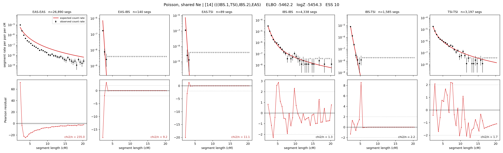

# `(((IBS.1,TSI),IBS.2),EAS)`

**Poisson, shared Ne** | topology 14 of 21 | admixed leaf: **IBS** | 4 events, 8 nodes

## Model score

| quantity | value | |
|---|---|---|
| ELBO | -5462.20 | +- 0.10 (MC) |
| logZ (importance sampling) | -5454.33 | |
| ESS of the IS weights | 10.4 / 4000 | LOW -- treat logZ with suspicion |
| Stan dropped-constant correction | -24.10 | already applied |
| mode kept / MAP start / runtime | 2 / 8 | 17 s |
| mode search | 10/12 MAP starts succeeded | 3 distinct modes evaluated |

## Events (in temporal order, most recent first)

| # | type | detail | time (gen) | cumulative |
|---|---|---|---|---|
| 1 | ADMIXTURE | IBS -> IBS.1 + IBS.2 | 64.1 +- 0.6 | 64.1 |
| 2 | MERGE | IBS.2 + TSI -> n1 | 85.0 +- 1.0 | 149.1 |
| 3 | MERGE | IBS.1 + n1 -> n2 | 191.6 +- 1.0 | 340.8 |
| 4 | MERGE | n2 + EAS -> root | 18.8 +- 0.0 | 359.6 |

## Admixture fraction

**f = 0.002 +- 0.000** (fraction from `IBS.1`; 0.998 from `IBS.2`)

Collapsed to a tree: one source carries <5% of the ancestry, so this graph is behaving as its no-admixture special case.

## Effective sizes shared by IBD and SNP (haploid)

| node | Ne | sd of log Ne |
|---|---|---|
| `EAS` | 898,944 | 0.01 |
| `IBS` | 1,030,003 | 0.04 |
| `TSI` | 407,667 | 0.03 |
| `IBS.1` | 65 | 0.01 |
| `IBS.2` | 90,942 | 0.02 |
| `n1` | 26,491 | 0.02 |
| `n2` | 108 | 0.01 |
| `root` | 118 | 0.01 |

log-Ne random-walk step scale tau = 1.167

## Fit quality by component

| component | log-likelihood | n terms | chi2/n |
|---|---|---|---|
| IBD | -5,343.3 | 222 | 43.48 |
| SNP | +36.4 | 6 | 2.40 |

IBD chi2/n uses Poisson counting variance; SNP chi2/n uses its block SEs. Values near 1 indicate residuals on the modeled noise scale.

## SNP covariance residuals `(w_hat - W_pred)/w_se`

| | EAS | IBS | TSI |
|---|---|---|---|
| **EAS** | -0.28 | +0.64 | -0.08 |
| **IBS** | +0.64 | +0.89 | -2.26 |
| **TSI** | -0.08 | -2.26 | +2.28 |

