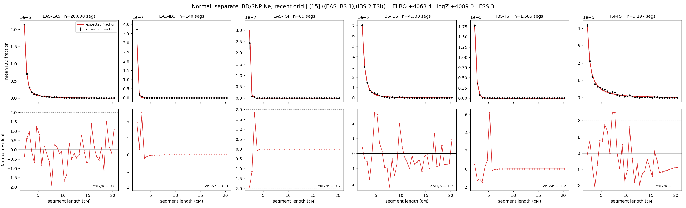

# `((EAS,IBS.1),(IBS.2,TSI))`

**Normal, separate IBD/SNP Ne, recent grid** | topology 15 of 21 | admixed leaf: **IBS** | 4 events, 8 nodes

> Recent Ne grid: 0-5 and 5-10 generations. The first demographic event is explicitly constrained to occur after generation 10 (minimum 11 with the current one-generation gap).

## Model score

| quantity | value | |
|---|---|---|
| ELBO | +4063.38 | +- 0.37 (MC) |
| logZ (importance sampling) | +4089.01 | |
| ESS of the IS weights | 3.4 / 4000 | LOW -- treat logZ with suspicion |
| Stan dropped-constant correction | -40.81 | already applied |
| mode kept / MAP start / runtime | 1 / 11 | 26 s |
| mode search | 12/12 MAP starts succeeded | 3 distinct modes evaluated |

## Events (in temporal order, most recent first)

| # | type | detail | time (gen) | cumulative |
|---|---|---|---|---|
| 1 | ADMIXTURE | IBS -> IBS.1 + IBS.2 | 76.2 +- 0.6 | 76.2 |
| 2 | MERGE | IBS.1 + EAS -> n1 | 57.3 +- 0.7 | 133.5 |
| 3 | MERGE | IBS.2 + TSI -> n2 | 8.1 +- 1.5 | 141.6 |
| 4 | MERGE | n1 + n2 -> root | 155.7 +- 2.5 | 297.3 |

## Admixture fraction

**f = 0.001 +- 0.000** (fraction from `IBS.1`; 0.999 from `IBS.2`)

Collapsed to a tree: one source carries <5% of the ancestry, so this graph is behaving as its no-admixture special case.

## Recent effective sizes for IBD (haploid)

| population | 0-5 gen | 5-10 gen |
|---|---:|---:|
| `EAS` | 4,479,374 | 3,920,338 |
| `IBS` | 1,444,785 | 1,229,511 |
| `TSI` | 961,770 | 742,528 |

## Effective sizes for IBD (haploid)

| node | Ne | sd of log Ne |
|---|---|---|
| `EAS` | 2,375,499 | 0.03 |
| `IBS` | 817,120 | 0.08 |
| `TSI` | 391,948 | 0.05 |
| `IBS.1` | 54,001 | 0.06 |
| `IBS.2` | 65,355 | 0.03 |
| `n1` | 38,135 | 0.03 |
| `n2` | 29,570 | 0.04 |
| `root` | 7,528 | 0.03 |

log-Ne random-walk step scale tau_ibd = 1.510

## Recent effective sizes for SNP (haploid)

| population | 0-5 gen | 5-10 gen |
|---|---:|---:|
| `EAS` | 1,134 | 1,187 |
| `IBS` | 110,513 | 108,422 |
| `TSI` | 112,389 | 112,680 |

## Effective sizes for SNP (haploid)

| node | Ne | sd of log Ne |
|---|---|---|
| `EAS` | 1,148 | 0.02 |
| `IBS` | 112,201 | 0.08 |
| `TSI` | 109,962 | 0.09 |
| `IBS.1` | 2,779 | 0.02 |
| `IBS.2` | 85,040 | 0.08 |
| `n1` | 2,650 | 0.01 |
| `n2` | 64,518 | 0.06 |
| `root` | 13,011 | 0.03 |

log-Ne random-walk step scale tau_snp = 0.825

## Fit quality by component

| component | log-likelihood | n terms | chi2/n |
|---|---|---|---|
| IBD | +4,253.5 | 222 | 0.96 |
| SNP | +33.7 | 6 | 3.32 |

IBD chi2/n uses Palamara model-derived Normal variance; SNP chi2/n uses its block SEs. Values near 1 indicate residuals on the modeled noise scale.

## SNP covariance residuals `(w_hat - W_pred)/w_se`

| | EAS | IBS | TSI |
|---|---|---|---|
| **EAS** | -0.06 | +0.15 | -0.03 |
| **IBS** | +0.15 | -0.29 | -0.00 |
| **TSI** | -0.03 | -0.00 | +0.06 |

