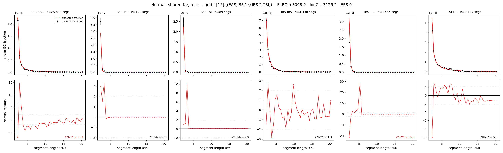

# `((EAS,IBS.1),(IBS.2,TSI))`

**Normal, shared Ne, recent grid** | topology 15 of 21 | admixed leaf: **IBS** | 4 events, 8 nodes

> Recent Ne grid: 0-5 and 5-10 generations. The first demographic event is explicitly constrained to occur after generation 10 (minimum 11 with the current one-generation gap).

## Model score

| quantity | value | |
|---|---|---|
| ELBO | +3098.23 | +- 0.43 (MC) |
| logZ (importance sampling) | +3126.21 | |
| ESS of the IS weights | 9.4 / 4000 | LOW -- treat logZ with suspicion |
| Stan dropped-constant correction | -29.61 | already applied |
| mode kept / MAP start / runtime | 2 / 4 | 29 s |
| mode search | 12/12 MAP starts succeeded | 3 distinct modes evaluated |

## Events (in temporal order, most recent first)

| # | type | detail | time (gen) | cumulative |
|---|---|---|---|---|
| 1 | ADMIXTURE | IBS -> IBS.1 + IBS.2 | 45.4 +- 2.4 | 45.4 |
| 2 | MERGE | IBS.1 + EAS -> n1 | 155.2 +- 1.4 | 200.5 |
| 3 | MERGE | IBS.2 + TSI -> n2 | 1.6 +- 0.0 | 202.1 |
| 4 | MERGE | n1 + n2 -> root | 250.5 +- 2.2 | 452.7 |

## Admixture fraction

**f = 0.004 +- 0.000** (fraction from `IBS.1`; 0.996 from `IBS.2`)

Collapsed to a tree: one source carries <5% of the ancestry, so this graph is behaving as its no-admixture special case.

## Recent effective sizes shared by IBD and SNP (haploid)

| population | 0-5 gen | 5-10 gen |
|---|---:|---:|
| `EAS` | 4,034,882 | 3,023,923 |
| `IBS` | 1,230,964 | 1,271,742 |
| `TSI` | 448,486 | 464,659 |

## Effective sizes shared by IBD and SNP (haploid)

| node | Ne | sd of log Ne |
|---|---|---|
| `EAS` | 1,905,221 | 0.04 |
| `IBS` | 1,116,977 | 0.05 |
| `TSI` | 453,073 | 0.04 |
| `IBS.1` | 6,205 | 0.02 |
| `IBS.2` | 174,064 | 0.05 |
| `n1` | 4,137 | 0.02 |
| `n2` | 2,109 | 0.02 |
| `root` | 4 | 0.04 |

log-Ne random-walk step scale tau = 0.911

## Fit quality by component

| component | log-likelihood | n terms | chi2/n |
|---|---|---|---|
| IBD | +3,333.9 | 222 | 9.78 |
| SNP | +27.0 | 6 | 5.54 |

IBD chi2/n uses Palamara model-derived Normal variance; SNP chi2/n uses its block SEs. Values near 1 indicate residuals on the modeled noise scale.

## SNP covariance residuals `(w_hat - W_pred)/w_se`

| | EAS | IBS | TSI |
|---|---|---|---|
| **EAS** | +0.99 | -1.33 | -0.62 |
| **IBS** | -1.33 | +3.43 | -0.96 |
| **TSI** | -0.62 | -0.96 | +2.09 |

