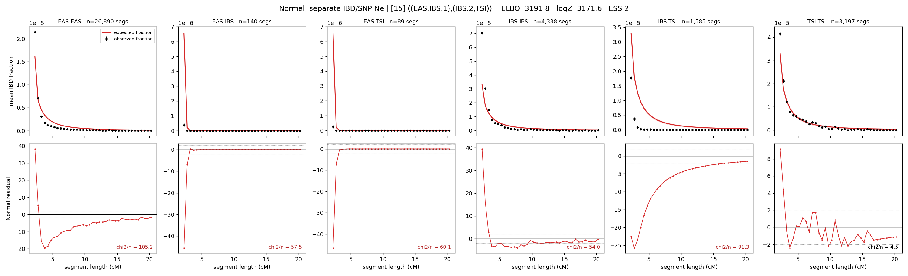

# `((EAS,IBS.1),(IBS.2,TSI))`

**Normal, separate IBD/SNP Ne** | topology 15 of 21 | admixed leaf: **IBS** | 4 events, 8 nodes

## Model score

| quantity | value | |
|---|---|---|
| ELBO | -3191.80 | +- 0.23 (MC) |
| logZ (importance sampling) | -3171.57 | |
| ESS of the IS weights | 2.3 / 4000 | LOW -- treat logZ with suspicion |
| Stan dropped-constant correction | -29.78 | already applied |
| seed kept / runtime | 7 | 17 s |

## Events (in temporal order, most recent first)

| # | type | detail | time (gen) | cumulative |
|---|---|---|---|---|
| 1 | ADMIXTURE | IBS -> IBS.1 + IBS.2 | 1.0 +- 0.0 | 1.0 |
| 2 | MERGE | IBS.1 + EAS -> n1 | 1.0 +- 0.0 | 2.0 |
| 3 | MERGE | IBS.2 + TSI -> n2 | 1.0 +- 0.0 | 3.0 |
| 4 | MERGE | n1 + n2 -> root | 358.0 +- 0.4 | 361.0 |

## Admixture fraction

**f = 0.000 +- 0.000** (fraction from `IBS.1`; 1.000 from `IBS.2`)

Collapsed to a tree: one source carries <5% of the ancestry, so this graph is behaving as its no-admixture special case.

## Effective sizes for IBD (haploid)

| node | Ne | sd of log Ne |
|---|---|---|
| `EAS` | 1,503,909 | 0.02 |
| `IBS` | 424,850 | 0.03 |
| `TSI` | 433,193 | 0.03 |
| `IBS.1` | 1,050,834 | 0.02 |
| `IBS.2` | 423,685 | 0.03 |
| `n1` | 1,050,847 | 0.02 |
| `n2` | 379,557 | 0.03 |
| `root` | 6 | 0.04 |

log-Ne random-walk step scale tau_ibd = 2.023

## Effective sizes for SNP (haploid)

| node | Ne | sd of log Ne |
|---|---|---|
| `EAS` | 3,973 | 0.00 |
| `IBS` | 3,966 | 0.00 |
| `TSI` | 3,966 | 0.00 |
| `IBS.1` | 3,973 | 0.00 |
| `IBS.2` | 3,966 | 0.00 |
| `n1` | 3,973 | 0.00 |
| `n2` | 3,966 | 0.00 |
| `root` | 3,970 | 0.00 |

log-Ne random-walk step scale tau_snp = 0.000

## Fit quality by component

| component | log-likelihood | n terms | chi2/n |
|---|---|---|---|
| IBD | -2,900.7 | 222 | 62.17 |
| SNP | +39.0 | 6 | 1.55 |

IBD chi2/n uses Palamara model-derived Normal variance; SNP chi2/n uses its block SEs. Values near 1 indicate residuals on the modeled noise scale.

## SNP covariance residuals `(w_hat - W_pred)/w_se`

| | EAS | IBS | TSI |
|---|---|---|---|
| **EAS** | -0.28 | +0.34 | +0.22 |
| **IBS** | +0.34 | +1.26 | -2.04 |
| **TSI** | +0.22 | -2.04 | +1.51 |

