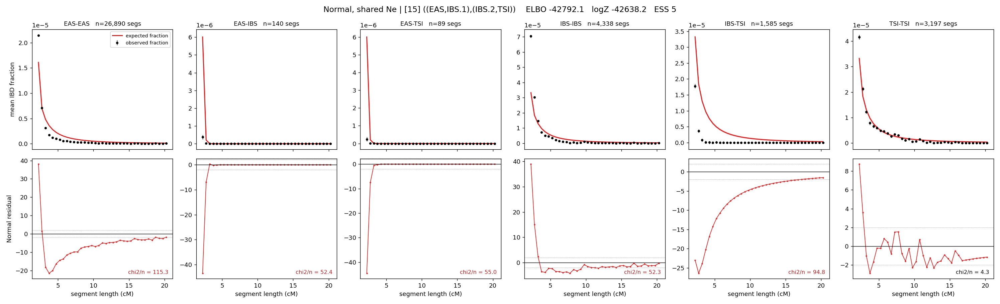

# `((EAS,IBS.1),(IBS.2,TSI))`

**Normal, shared Ne** | topology 15 of 21 | admixed leaf: **IBS** | 4 events, 8 nodes

## Model score

| quantity | value | |
|---|---|---|
| ELBO | -42792.05 | +- 3.07 (MC) |
| logZ (importance sampling) | -42638.20 | |
| ESS of the IS weights | 4.7 / 4000 | LOW -- treat logZ with suspicion |
| Stan dropped-constant correction | -24.10 | already applied |
| seed kept / runtime | 13 | 4 s |

## Events (in temporal order, most recent first)

| # | type | detail | time (gen) | cumulative |
|---|---|---|---|---|
| 1 | ADMIXTURE | IBS -> IBS.1 + IBS.2 | 1.0 +- 0.0 | 1.0 |
| 2 | MERGE | IBS.1 + EAS -> n1 | 1.0 +- 0.0 | 2.0 |
| 3 | MERGE | IBS.2 + TSI -> n2 | 1.0 +- 0.0 | 3.0 |
| 4 | MERGE | n1 + n2 -> root | 341.8 +- 3.5 | 344.8 |

## Admixture fraction

**f = 0.000 +- 0.000** (fraction from `IBS.1`; 1.000 from `IBS.2`)

Collapsed to a tree: one source carries <5% of the ancestry, so this graph is behaving as its no-admixture special case.

## Effective sizes shared by IBD and SNP (haploid)

| node | Ne | sd of log Ne |
|---|---|---|
| `EAS` | 1,030,047 | 0.13 |
| `IBS` | 368,357 | 0.05 |
| `TSI` | 368,913 | 0.05 |
| `IBS.1` | 1,008,773 | 0.13 |
| `IBS.2` | 368,512 | 0.05 |
| `n1` | 1,008,784 | 0.13 |
| `n2` | 367,901 | 0.05 |
| `root` | 39 | 0.20 |

log-Ne random-walk step scale tau = 1.491

## Fit quality by component

| component | log-likelihood | n terms | chi2/n |
|---|---|---|---|
| IBD | -3,047.9 | 222 | 63.54 |
| SNP | -39,482.0 | 6 | 13175.21 |

IBD chi2/n uses Palamara model-derived Normal variance; SNP chi2/n uses its block SEs. Values near 1 indicate residuals on the modeled noise scale.

## SNP covariance residuals `(w_hat - W_pred)/w_se`

| | EAS | IBS | TSI |
|---|---|---|---|
| **EAS** | +116.83 | -114.99 | -115.93 |
| **IBS** | -114.99 | +113.14 | +113.46 |
| **TSI** | -115.93 | +113.46 | +114.31 |

