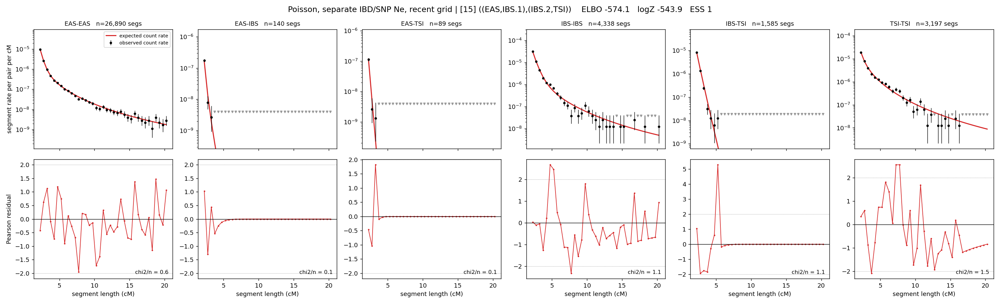

# `((EAS,IBS.1),(IBS.2,TSI))`

**Poisson, separate IBD/SNP Ne, recent grid** | topology 15 of 21 | admixed leaf: **IBS** | 4 events, 8 nodes

> Recent Ne grid: 0-5 and 5-10 generations. The first demographic event is explicitly constrained to occur after generation 10 (minimum 11 with the current one-generation gap).

## Model score

| quantity | value | |
|---|---|---|
| ELBO | -574.07 | +- 0.33 (MC) |
| logZ (importance sampling) | -543.94 | |
| ESS of the IS weights | 1.4 / 4000 | LOW -- treat logZ with suspicion |
| Stan dropped-constant correction | -40.81 | already applied |
| seed kept / runtime | 7 | 24 s |

## Events (in temporal order, most recent first)

| # | type | detail | time (gen) | cumulative |
|---|---|---|---|---|
| 1 | ADMIXTURE | IBS -> IBS.1 + IBS.2 | 86.6 +- 6.1 | 86.6 |
| 2 | MERGE | IBS.1 + EAS -> n1 | 48.1 +- 6.5 | 134.7 |
| 3 | MERGE | IBS.2 + TSI -> n2 | 1.4 +- 0.0 | 136.1 |
| 4 | MERGE | n1 + n2 -> root | 149.1 +- 0.8 | 285.1 |

## Admixture fraction

**f = 0.005 +- 0.001** (fraction from `IBS.1`; 0.995 from `IBS.2`)

Collapsed to a tree: one source carries <5% of the ancestry, so this graph is behaving as its no-admixture special case.

## Recent effective sizes for IBD (haploid)

| population | 0-5 gen | 5-10 gen |
|---|---:|---:|
| `EAS` | 4,220,485 | 3,865,573 |
| `IBS` | 1,631,897 | 1,371,699 |
| `TSI` | 1,029,885 | 804,162 |

## Effective sizes for IBD (haploid)

| node | Ne | sd of log Ne |
|---|---|---|
| `EAS` | 2,362,161 | 0.02 |
| `IBS` | 748,219 | 0.08 |
| `TSI` | 391,788 | 0.04 |
| `IBS.1` | 37,075 | 0.02 |
| `IBS.2` | 46,171 | 0.23 |
| `n1` | 36,522 | 0.02 |
| `n2` | 35,383 | 0.03 |
| `root` | 13,856 | 0.05 |

log-Ne random-walk step scale tau_ibd = 1.459

## Recent effective sizes for SNP (haploid)

| population | 0-5 gen | 5-10 gen |
|---|---:|---:|
| `EAS` | 1,886 | 1,841 |
| `IBS` | 82,327 | 81,489 |
| `TSI` | 164,135 | 159,540 |

## Effective sizes for SNP (haploid)

| node | Ne | sd of log Ne |
|---|---|---|
| `EAS` | 1,616 | 0.02 |
| `IBS` | 79,052 | 0.03 |
| `TSI` | 147,619 | 0.03 |
| `IBS.1` | 1,591 | 0.03 |
| `IBS.2` | 62,758 | 0.04 |
| `n1` | 1,587 | 0.03 |
| `n2` | 42,923 | 0.03 |
| `root` | 10,319 | 0.02 |

log-Ne random-walk step scale tau_snp = 0.769

## Fit quality by component

| component | log-likelihood | n terms | chi2/n |
|---|---|---|---|
| IBD | -349.3 | 222 | 0.88 |
| SNP | +36.7 | 6 | 2.29 |

IBD chi2/n uses Poisson counting variance; SNP chi2/n uses its block SEs. Values near 1 indicate residuals on the modeled noise scale.

## SNP covariance residuals `(w_hat - W_pred)/w_se`

| | EAS | IBS | TSI |
|---|---|---|---|
| **EAS** | -0.00 | +0.05 | -0.04 |
| **IBS** | +0.05 | -0.20 | +0.11 |
| **TSI** | -0.04 | +0.11 | -0.02 |

