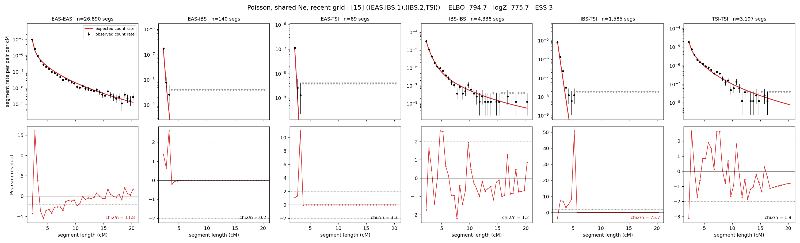

# `((EAS,IBS.1),(IBS.2,TSI))`

**Poisson, shared Ne, recent grid** | topology 15 of 21 | admixed leaf: **IBS** | 4 events, 8 nodes

> Recent Ne grid: 0-5 and 5-10 generations. The first demographic event is explicitly constrained to occur after generation 10 (minimum 11 with the current one-generation gap).

## Model score

| quantity | value | |
|---|---|---|
| ELBO | -794.73 | +- 0.22 (MC) |
| logZ (importance sampling) | -775.72 | |
| ESS of the IS weights | 2.7 / 4000 | LOW -- treat logZ with suspicion |
| Stan dropped-constant correction | -29.61 | already applied |
| seed kept / runtime | 7 | 23 s |

## Events (in temporal order, most recent first)

| # | type | detail | time (gen) | cumulative |
|---|---|---|---|---|
| 1 | ADMIXTURE | IBS -> IBS.1 + IBS.2 | 71.9 +- 0.5 | 71.9 |
| 2 | MERGE | IBS.1 + EAS -> n1 | 139.6 +- 0.7 | 211.5 |
| 3 | MERGE | IBS.2 + TSI -> n2 | 1.1 +- 0.0 | 212.6 |
| 4 | MERGE | n1 + n2 -> root | 240.7 +- 0.8 | 453.3 |

## Admixture fraction

**f = 0.007 +- 0.000** (fraction from `IBS.1`; 0.993 from `IBS.2`)

Collapsed to a tree: one source carries <5% of the ancestry, so this graph is behaving as its no-admixture special case.

## Recent effective sizes shared by IBD and SNP (haploid)

| population | 0-5 gen | 5-10 gen |
|---|---:|---:|
| `EAS` | 10,489,924 | 7,903,449 |
| `IBS` | 1,311,696 | 1,168,243 |
| `TSI` | 1,289,283 | 939,094 |

## Effective sizes shared by IBD and SNP (haploid)

| node | Ne | sd of log Ne |
|---|---|---|
| `EAS` | 1,768,745 | 0.03 |
| `IBS` | 827,239 | 0.08 |
| `TSI` | 392,615 | 0.03 |
| `IBS.1` | 3,123 | 0.01 |
| `IBS.2` | 80,799 | 0.04 |
| `n1` | 2,991 | 0.01 |
| `n2` | 2,395 | 0.01 |
| `root` | 5 | 0.02 |

log-Ne random-walk step scale tau = 1.921

## Fit quality by component

| component | log-likelihood | n terms | chi2/n |
|---|---|---|---|
| IBD | -618.4 | 222 | 15.83 |
| SNP | +37.0 | 6 | 2.21 |

IBD chi2/n uses Poisson counting variance; SNP chi2/n uses its block SEs. Values near 1 indicate residuals on the modeled noise scale.

## SNP covariance residuals `(w_hat - W_pred)/w_se`

| | EAS | IBS | TSI |
|---|---|---|---|
| **EAS** | +0.19 | -0.75 | +0.38 |
| **IBS** | -0.75 | +1.76 | -0.36 |
| **TSI** | +0.38 | -0.36 | -0.38 |

