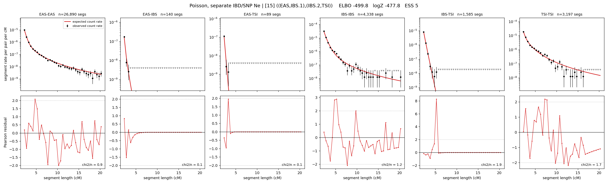

# `((EAS,IBS.1),(IBS.2,TSI))`

**Poisson, separate IBD/SNP Ne** | topology 15 of 21 | admixed leaf: **IBS** | 4 events, 8 nodes

## Model score

| quantity | value | |
|---|---|---|
| ELBO | -499.80 | +- 0.26 (MC) |
| logZ (importance sampling) | -477.77 | |
| ESS of the IS weights | 5.0 / 4000 | LOW -- treat logZ with suspicion |
| Stan dropped-constant correction | -29.78 | already applied |
| mode kept / MAP start / runtime | 1 / 2 | 19 s |
| mode search | 12/12 MAP starts succeeded | 3 distinct modes evaluated |

## Events (in temporal order, most recent first)

| # | type | detail | time (gen) | cumulative |
|---|---|---|---|---|
| 1 | ADMIXTURE | IBS -> IBS.1 + IBS.2 | 70.4 +- 1.0 | 70.4 |
| 2 | MERGE | IBS.1 + EAS -> n1 | 56.7 +- 1.2 | 127.2 |
| 3 | MERGE | IBS.2 + TSI -> n2 | 23.5 +- 0.5 | 150.7 |
| 4 | MERGE | n1 + n2 -> root | 138.6 +- 0.9 | 289.3 |

## Admixture fraction

**f = 0.005 +- 0.000** (fraction from `IBS.1`; 0.995 from `IBS.2`)

Collapsed to a tree: one source carries <5% of the ancestry, so this graph is behaving as its no-admixture special case.

## Effective sizes for IBD (haploid)

| node | Ne | sd of log Ne |
|---|---|---|
| `EAS` | 2,574,724 | 0.04 |
| `IBS` | 935,264 | 0.08 |
| `TSI` | 408,652 | 0.03 |
| `IBS.1` | 33,762 | 0.05 |
| `IBS.2` | 76,965 | 0.05 |
| `n1` | 45,524 | 0.02 |
| `n2` | 21,369 | 0.02 |
| `root` | 12,034 | 0.02 |

log-Ne random-walk step scale tau_ibd = 1.292

## Effective sizes for SNP (haploid)

| node | Ne | sd of log Ne |
|---|---|---|
| `EAS` | 1,024 | 0.01 |
| `IBS` | 107,309 | 0.04 |
| `TSI` | 129,469 | 0.03 |
| `IBS.1` | 3,249 | 0.02 |
| `IBS.2` | 80,834 | 0.02 |
| `n1` | 3,011 | 0.01 |
| `n2` | 54,312 | 0.02 |
| `root` | 16,641 | 0.01 |

log-Ne random-walk step scale tau_snp = 0.829

## Fit quality by component

| component | log-likelihood | n terms | chi2/n |
|---|---|---|---|
| IBD | -361.3 | 222 | 1.11 |
| SNP | +38.9 | 6 | 1.56 |

IBD chi2/n uses Poisson counting variance; SNP chi2/n uses its block SEs. Values near 1 indicate residuals on the modeled noise scale.

## SNP covariance residuals `(w_hat - W_pred)/w_se`

| | EAS | IBS | TSI |
|---|---|---|---|
| **EAS** | +0.03 | -0.04 | -0.03 |
| **IBS** | -0.04 | -0.09 | +0.17 |
| **TSI** | -0.03 | +0.17 | -0.11 |

