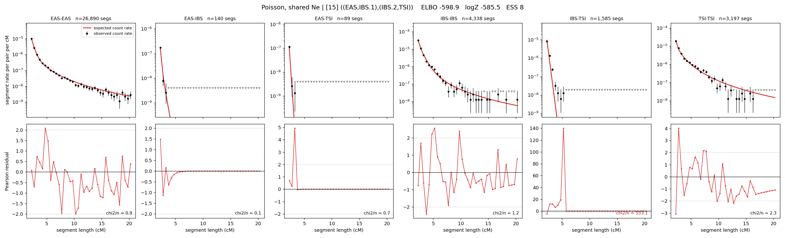

# `((EAS,IBS.1),(IBS.2,TSI))`

**Poisson, shared Ne** | topology 15 of 21 | admixed leaf: **IBS** | 4 events, 8 nodes

## Model score

| quantity | value | |
|---|---|---|
| ELBO | -598.90 | +- 0.19 (MC) |
| logZ (importance sampling) | -585.47 | |
| ESS of the IS weights | 8.5 / 4000 | LOW -- treat logZ with suspicion |
| Stan dropped-constant correction | -24.10 | already applied |
| mode kept / MAP start / runtime | 1 / 9 | 18 s |
| mode search | 10/12 MAP starts succeeded | 3 distinct modes evaluated |

## Events (in temporal order, most recent first)

| # | type | detail | time (gen) | cumulative |
|---|---|---|---|---|
| 1 | ADMIXTURE | IBS -> IBS.1 + IBS.2 | 59.1 +- 0.5 | 59.1 |
| 2 | MERGE | IBS.1 + EAS -> n1 | 68.4 +- 0.7 | 127.5 |
| 3 | MERGE | IBS.2 + TSI -> n2 | 120.2 +- 1.8 | 247.8 |
| 4 | MERGE | n1 + n2 -> root | 113.9 +- 6.7 | 361.7 |

## Admixture fraction

**f = 0.006 +- 0.000** (fraction from `IBS.1`; 0.994 from `IBS.2`)

Collapsed to a tree: one source carries <5% of the ancestry, so this graph is behaving as its no-admixture special case.

## Effective sizes shared by IBD and SNP (haploid)

| node | Ne | sd of log Ne |
|---|---|---|
| `EAS` | 2,570,016 | 0.02 |
| `IBS` | 1,052,853 | 0.05 |
| `TSI` | 406,866 | 0.03 |
| `IBS.1` | 75,593 | 0.05 |
| `IBS.2` | 107,354 | 0.04 |
| `n1` | 45,045 | 0.01 |
| `n2` | 647 | 0.06 |
| `root` | 933 | 0.22 |

log-Ne random-walk step scale tau = 1.604

## Fit quality by component

| component | log-likelihood | n terms | chi2/n |
|---|---|---|---|
| IBD | -496.1 | 222 | 94.42 |
| SNP | +38.7 | 6 | 1.66 |

IBD chi2/n uses Poisson counting variance; SNP chi2/n uses its block SEs. Values near 1 indicate residuals on the modeled noise scale.

## SNP covariance residuals `(w_hat - W_pred)/w_se`

| | EAS | IBS | TSI |
|---|---|---|---|
| **EAS** | +0.06 | -0.46 | +0.35 |
| **IBS** | -0.46 | +1.24 | -0.39 |
| **TSI** | +0.35 | -0.39 | -0.30 |

