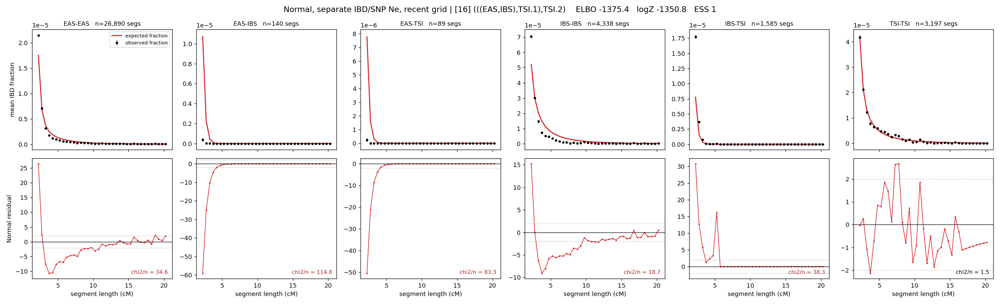

# `(((EAS,IBS),TSI.1),TSI.2)`

**Normal, separate IBD/SNP Ne, recent grid** | topology 16 of 21 | admixed leaf: **TSI** | 4 events, 8 nodes

> Recent Ne grid: 0-5 and 5-10 generations. The first demographic event is explicitly constrained to occur after generation 10 (minimum 11 with the current one-generation gap).

> Graph where the two NON-admixed leaves merge first. Excluded by the 'first merge must involve an admixture branch' rule; included here because it is the standard local-clade + deep-source scenario.

## Model score

| quantity | value | |
|---|---|---|
| ELBO | -1375.42 | +- 0.25 (MC) |
| logZ (importance sampling) | -1350.80 | |
| ESS of the IS weights | 1.0 / 4000 | LOW -- treat logZ with suspicion |
| Stan dropped-constant correction | -40.81 | already applied |
| mode kept / MAP start / runtime | 3 / 2 | 26 s |
| mode search | 12/12 MAP starts succeeded | 3 distinct modes evaluated |

## Events (in temporal order, most recent first)

| # | type | detail | time (gen) | cumulative |
|---|---|---|---|---|
| 1 | ADMIXTURE | TSI -> TSI.1 + TSI.2 | 130.2 +- 0.7 | 130.2 |
| 2 | MERGE | EAS + IBS -> n1 | 36.4 +- 0.2 | 166.6 |
| 3 | MERGE | TSI.2 + n1 -> n2 | 2.2 +- 0.1 | 168.7 |
| 4 | MERGE | TSI.1 + n2 -> root | 8.4 +- 0.1 | 177.1 |

## Admixture fraction

**f = 0.062 +- 0.004** (fraction from `TSI.1`; 0.938 from `TSI.2`)

## Recent effective sizes for IBD (haploid)

| population | 0-5 gen | 5-10 gen |
|---|---:|---:|
| `EAS` | 39,090,020 | 21,116,540 |
| `IBS` | 3,291,602 | 2,156,532 |
| `TSI` | 1,545,095 | 1,050,065 |

## Effective sizes for IBD (haploid)

| node | Ne | sd of log Ne |
|---|---|---|
| `EAS` | 1,420,327 | 0.03 |
| `IBS` | 233,578 | 0.02 |
| `TSI` | 390,331 | 0.05 |
| `TSI.1` | 108,657 | 0.02 |
| `TSI.2` | 43,465 | 0.03 |
| `n1` | 6,099 | 0.02 |
| `n2` | 8,512 | 0.02 |
| `root` | 76,098 | 0.01 |

log-Ne random-walk step scale tau_ibd = 2.197

## Recent effective sizes for SNP (haploid)

| population | 0-5 gen | 5-10 gen |
|---|---:|---:|
| `EAS` | 814 | 855 |
| `IBS` | 116,787 | 118,409 |
| `TSI` | 129,021 | 126,070 |

## Effective sizes for SNP (haploid)

| node | Ne | sd of log Ne |
|---|---|---|
| `EAS` | 931 | 0.01 |
| `IBS` | 125,127 | 0.03 |
| `TSI` | 140,733 | 0.03 |
| `TSI.1` | 21,802 | 0.01 |
| `TSI.2` | 53,617 | 0.02 |
| `n1` | 22,194 | 0.01 |
| `n2` | 23,633 | 0.01 |
| `root` | 21,939 | 0.01 |

log-Ne random-walk step scale tau_snp = 1.009

## Fit quality by component

| component | log-likelihood | n terms | chi2/n |
|---|---|---|---|
| IBD | -1,123.5 | 222 | 48.64 |
| SNP | +40.4 | 6 | 1.06 |

IBD chi2/n uses Palamara model-derived Normal variance; SNP chi2/n uses its block SEs. Values near 1 indicate residuals on the modeled noise scale.

## SNP covariance residuals `(w_hat - W_pred)/w_se`

| | EAS | IBS | TSI |
|---|---|---|---|
| **EAS** | +0.04 | -0.14 | +0.06 |
| **IBS** | -0.14 | -0.18 | +0.48 |
| **TSI** | +0.06 | +0.48 | -0.56 |

