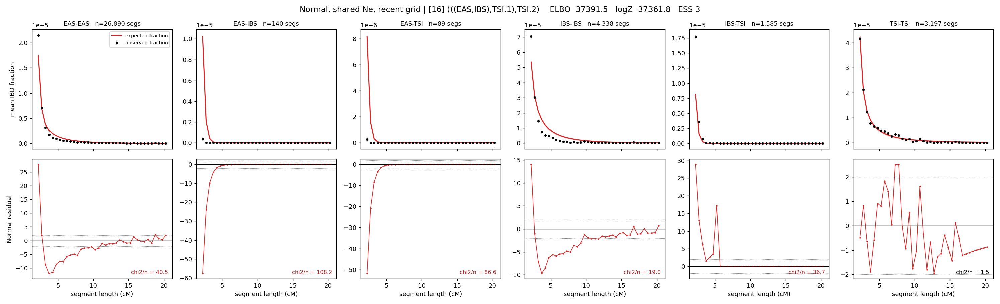

# `(((EAS,IBS),TSI.1),TSI.2)`

**Normal, shared Ne, recent grid** | topology 16 of 21 | admixed leaf: **TSI** | 4 events, 8 nodes

> Recent Ne grid: 0-5 and 5-10 generations. The first demographic event is explicitly constrained to occur after generation 10 (minimum 11 with the current one-generation gap).

> Graph where the two NON-admixed leaves merge first. Excluded by the 'first merge must involve an admixture branch' rule; included here because it is the standard local-clade + deep-source scenario.

## Model score

| quantity | value | |
|---|---|---|
| ELBO | -37391.53 | +- 0.42 (MC) |
| logZ (importance sampling) | -37361.76 | |
| ESS of the IS weights | 3.4 / 4000 | LOW -- treat logZ with suspicion |
| Stan dropped-constant correction | -29.61 | already applied |
| mode kept / MAP start / runtime | 1 / 11 | 29 s |
| mode search | 12/12 MAP starts succeeded | 3 distinct modes evaluated |

## Events (in temporal order, most recent first)

| # | type | detail | time (gen) | cumulative |
|---|---|---|---|---|
| 1 | ADMIXTURE | TSI -> TSI.1 + TSI.2 | 156.1 +- 0.7 | 156.1 |
| 2 | MERGE | EAS + IBS -> n1 | 4.1 +- 0.1 | 160.2 |
| 3 | MERGE | TSI.2 + n1 -> n2 | 3.0 +- 0.1 | 163.1 |
| 4 | MERGE | TSI.1 + n2 -> root | 46.1 +- 0.5 | 209.2 |

## Admixture fraction

**f = 0.029 +- 0.000** (fraction from `TSI.1`; 0.971 from `TSI.2`)

Collapsed to a tree: one source carries <5% of the ancestry, so this graph is behaving as its no-admixture special case.

## Recent effective sizes shared by IBD and SNP (haploid)

| population | 0-5 gen | 5-10 gen |
|---|---:|---:|
| `EAS` | 41,951,505 | 28,357,810 |
| `IBS` | 14,999,190 | 7,574,206 |
| `TSI` | 1,118,485 | 652,211 |

## Effective sizes shared by IBD and SNP (haploid)

| node | Ne | sd of log Ne |
|---|---|---|
| `EAS` | 1,350,186 | 0.03 |
| `IBS` | 224,219 | 0.09 |
| `TSI` | 397,739 | 0.03 |
| `TSI.1` | 2 | 0.04 |
| `TSI.2` | 47,959 | 0.03 |
| `n1` | 13,998 | 0.05 |
| `n2` | 28,058 | 0.03 |
| `root` | 44,330 | 0.01 |

log-Ne random-walk step scale tau = 2.529

## Fit quality by component

| component | log-likelihood | n terms | chi2/n |
|---|---|---|---|
| IBD | -1,158.6 | 222 | 48.94 |
| SNP | -36,014.3 | 6 | 12019.30 |

IBD chi2/n uses Palamara model-derived Normal variance; SNP chi2/n uses its block SEs. Values near 1 indicate residuals on the modeled noise scale.

## SNP covariance residuals `(w_hat - W_pred)/w_se`

| | EAS | IBS | TSI |
|---|---|---|---|
| **EAS** | +112.65 | -124.81 | -97.76 |
| **IBS** | -124.81 | +94.12 | +153.89 |
| **TSI** | -97.76 | +153.89 | +41.62 |

