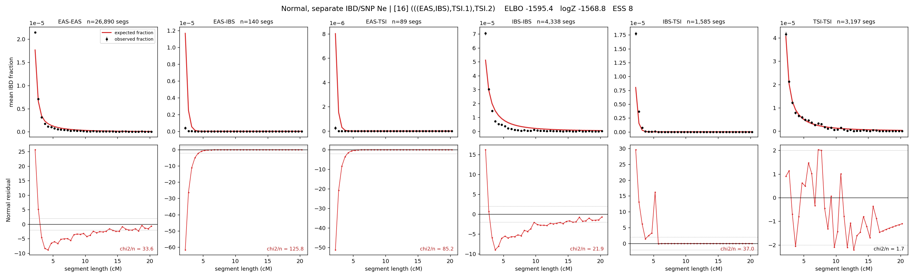

# `(((EAS,IBS),TSI.1),TSI.2)`

**Normal, separate IBD/SNP Ne** | topology 16 of 21 | admixed leaf: **TSI** | 4 events, 8 nodes

> Graph where the two NON-admixed leaves merge first. Excluded by the 'first merge must involve an admixture branch' rule; included here because it is the standard local-clade + deep-source scenario.

## Model score

| quantity | value | |
|---|---|---|
| ELBO | -1595.37 | +- 0.48 (MC) |
| logZ (importance sampling) | -1568.75 | |
| ESS of the IS weights | 7.7 / 4000 | LOW -- treat logZ with suspicion |
| Stan dropped-constant correction | -29.78 | already applied |
| seed kept / runtime | 7 | 19 s |

## Events (in temporal order, most recent first)

| # | type | detail | time (gen) | cumulative |
|---|---|---|---|---|
| 1 | ADMIXTURE | TSI -> TSI.1 + TSI.2 | 152.9 +- 0.6 | 152.9 |
| 2 | MERGE | EAS + IBS -> n1 | 1.3 +- 0.0 | 154.2 |
| 3 | MERGE | TSI.2 + n1 -> n2 | 4.1 +- 0.3 | 158.3 |
| 4 | MERGE | TSI.1 + n2 -> root | 1.4 +- 0.0 | 159.7 |

## Admixture fraction

**f = 0.997 +- 0.000** (fraction from `TSI.1`; 0.003 from `TSI.2`)

Collapsed to a tree: one source carries <5% of the ancestry, so this graph is behaving as its no-admixture special case.

## Effective sizes for IBD (haploid)

| node | Ne | sd of log Ne |
|---|---|---|
| `EAS` | 1,616,733 | 0.05 |
| `IBS` | 244,988 | 0.06 |
| `TSI` | 399,267 | 0.04 |
| `TSI.1` | 8,387 | 0.05 |
| `TSI.2` | 31,193 | 0.02 |
| `n1` | 13,247 | 0.04 |
| `n2` | 31,233 | 0.02 |
| `root` | 35,500 | 0.02 |

log-Ne random-walk step scale tau_ibd = 1.428

## Effective sizes for SNP (haploid)

| node | Ne | sd of log Ne |
|---|---|---|
| `EAS` | 854 | 0.01 |
| `IBS` | 135,635 | 0.04 |
| `TSI` | 180,979 | 0.02 |
| `TSI.1` | 20,939 | 0.01 |
| `TSI.2` | 33,659 | 0.01 |
| `n1` | 21,432 | 0.01 |
| `n2` | 33,688 | 0.01 |
| `root` | 32,548 | 0.01 |

log-Ne random-walk step scale tau_snp = 0.946

## Fit quality by component

| component | log-likelihood | n terms | chi2/n |
|---|---|---|---|
| IBD | -1,419.0 | 222 | 51.03 |
| SNP | +40.9 | 6 | 0.90 |

IBD chi2/n uses Palamara model-derived Normal variance; SNP chi2/n uses its block SEs. Values near 1 indicate residuals on the modeled noise scale.

## SNP covariance residuals `(w_hat - W_pred)/w_se`

| | EAS | IBS | TSI |
|---|---|---|---|
| **EAS** | -0.04 | -0.02 | +0.11 |
| **IBS** | -0.02 | +0.32 | -0.30 |
| **TSI** | +0.11 | -0.30 | +0.08 |

