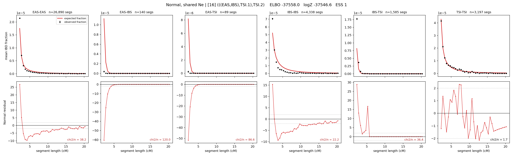

# `(((EAS,IBS),TSI.1),TSI.2)`

**Normal, shared Ne** | topology 16 of 21 | admixed leaf: **TSI** | 4 events, 8 nodes

> Graph where the two NON-admixed leaves merge first. Excluded by the 'first merge must involve an admixture branch' rule; included here because it is the standard local-clade + deep-source scenario.

## Model score

| quantity | value | |
|---|---|---|
| ELBO | -37557.96 | +- 0.13 (MC) |
| logZ (importance sampling) | -37546.56 | |
| ESS of the IS weights | 1.5 / 4000 | LOW -- treat logZ with suspicion |
| Stan dropped-constant correction | -24.10 | already applied |
| mode kept / MAP start / runtime | 1 / 11 | 20 s |
| mode search | 12/12 MAP starts succeeded | 3 distinct modes evaluated |

## Events (in temporal order, most recent first)

| # | type | detail | time (gen) | cumulative |
|---|---|---|---|---|
| 1 | ADMIXTURE | TSI -> TSI.1 + TSI.2 | 155.4 +- 0.5 | 155.4 |
| 2 | MERGE | EAS + IBS -> n1 | 1.0 +- 0.0 | 156.4 |
| 3 | MERGE | TSI.2 + n1 -> n2 | 4.7 +- 0.1 | 161.1 |
| 4 | MERGE | TSI.1 + n2 -> root | 360.1 +- 1.8 | 521.2 |

## Admixture fraction

**f = 0.041 +- 0.000** (fraction from `TSI.1`; 0.959 from `TSI.2`)

Collapsed to a tree: one source carries <5% of the ancestry, so this graph is behaving as its no-admixture special case.

## Effective sizes shared by IBD and SNP (haploid)

| node | Ne | sd of log Ne |
|---|---|---|
| `EAS` | 1,549,172 | 0.02 |
| `IBS` | 237,210 | 0.02 |
| `TSI` | 417,643 | 0.03 |
| `TSI.1` | 21 | 0.02 |
| `TSI.2` | 42,440 | 0.01 |
| `n1` | 16,815 | 0.01 |
| `n2` | 31,895 | 0.01 |
| `root` | 46,871 | 0.01 |

log-Ne random-walk step scale tau = 1.208

## Fit quality by component

| component | log-likelihood | n terms | chi2/n |
|---|---|---|---|
| IBD | -1,400.4 | 222 | 50.90 |
| SNP | -36,014.8 | 6 | 12019.48 |

IBD chi2/n uses Palamara model-derived Normal variance; SNP chi2/n uses its block SEs. Values near 1 indicate residuals on the modeled noise scale.

## SNP covariance residuals `(w_hat - W_pred)/w_se`

| | EAS | IBS | TSI |
|---|---|---|---|
| **EAS** | +112.67 | -124.83 | -97.76 |
| **IBS** | -124.83 | +94.18 | +153.86 |
| **TSI** | -97.76 | +153.86 | +41.66 |

