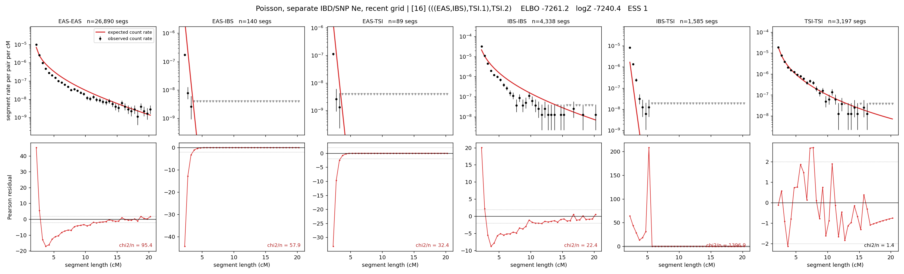

# `(((EAS,IBS),TSI.1),TSI.2)`

**Poisson, separate IBD/SNP Ne, recent grid** | topology 16 of 21 | admixed leaf: **TSI** | 4 events, 8 nodes

> Recent Ne grid: 0-5 and 5-10 generations. The first demographic event is explicitly constrained to occur after generation 10 (minimum 11 with the current one-generation gap).

> Graph where the two NON-admixed leaves merge first. Excluded by the 'first merge must involve an admixture branch' rule; included here because it is the standard local-clade + deep-source scenario.

## Model score

| quantity | value | |
|---|---|---|
| ELBO | -7261.20 | +- 0.24 (MC) |
| logZ (importance sampling) | -7240.40 | |
| ESS of the IS weights | 1.3 / 4000 | LOW -- treat logZ with suspicion |
| Stan dropped-constant correction | -40.81 | already applied |
| mode kept / MAP start / runtime | 1 / 11 | 27 s |
| mode search | 12/12 MAP starts succeeded | 3 distinct modes evaluated |

## Events (in temporal order, most recent first)

| # | type | detail | time (gen) | cumulative |
|---|---|---|---|---|
| 1 | ADMIXTURE | TSI -> TSI.1 + TSI.2 | 135.9 +- 0.4 | 135.9 |
| 2 | MERGE | EAS + IBS -> n1 | 93.7 +- 0.7 | 229.6 |
| 3 | MERGE | TSI.2 + n1 -> n2 | 2.2 +- 0.0 | 231.8 |
| 4 | MERGE | TSI.1 + n2 -> root | 129.7 +- 0.6 | 361.5 |

## Admixture fraction

**f = 0.398 +- 0.003** (fraction from `TSI.1`; 0.602 from `TSI.2`)

## Recent effective sizes for IBD (haploid)

| population | 0-5 gen | 5-10 gen |
|---|---:|---:|
| `EAS` | 128,318,498 | 45,245,182 |
| `IBS` | 5,759,894 | 3,816,568 |
| `TSI` | 1,445,486 | 1,216,539 |

## Effective sizes for IBD (haploid)

| node | Ne | sd of log Ne |
|---|---|---|
| `EAS` | 1,098,474 | 0.02 |
| `IBS` | 237,814 | 0.03 |
| `TSI` | 387,970 | 0.07 |
| `TSI.1` | 2,007,206 | 0.02 |
| `TSI.2` | 13,834 | 0.05 |
| `n1` | 5,443 | 0.01 |
| `n2` | 3,986 | 0.01 |
| `root` | 11,251 | 0.00 |

log-Ne random-walk step scale tau_ibd = 2.680

## Recent effective sizes for SNP (haploid)

| population | 0-5 gen | 5-10 gen |
|---|---:|---:|
| `EAS` | 1,276 | 1,261 |
| `IBS` | 182,197 | 173,124 |
| `TSI` | 343,937 | 317,294 |

## Effective sizes for SNP (haploid)

| node | Ne | sd of log Ne |
|---|---|---|
| `EAS` | 1,274 | 0.01 |
| `IBS` | 174,963 | 0.01 |
| `TSI` | 310,164 | 0.01 |
| `TSI.1` | 133,024 | 0.00 |
| `TSI.2` | 85,545 | 0.00 |
| `n1` | 51,968 | 0.00 |
| `n2` | 51,432 | 0.00 |
| `root` | 60,331 | 0.00 |

log-Ne random-walk step scale tau_snp = 0.648

## Fit quality by component

| component | log-likelihood | n terms | chi2/n |
|---|---|---|---|
| IBD | -6,963.3 | 222 | 269.85 |
| SNP | +39.8 | 6 | 1.28 |

IBD chi2/n uses Poisson counting variance; SNP chi2/n uses its block SEs. Values near 1 indicate residuals on the modeled noise scale.

## SNP covariance residuals `(w_hat - W_pred)/w_se`

| | EAS | IBS | TSI |
|---|---|---|---|
| **EAS** | +0.04 | -0.09 | +0.02 |
| **IBS** | -0.09 | -0.07 | +0.26 |
| **TSI** | +0.02 | +0.26 | -0.28 |

