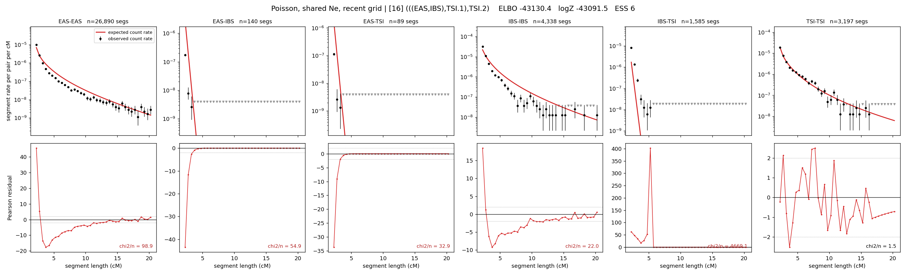

# `(((EAS,IBS),TSI.1),TSI.2)`

**Poisson, shared Ne, recent grid** | topology 16 of 21 | admixed leaf: **TSI** | 4 events, 8 nodes

> Recent Ne grid: 0-5 and 5-10 generations. The first demographic event is explicitly constrained to occur after generation 10 (minimum 11 with the current one-generation gap).

> Graph where the two NON-admixed leaves merge first. Excluded by the 'first merge must involve an admixture branch' rule; included here because it is the standard local-clade + deep-source scenario.

## Model score

| quantity | value | |
|---|---|---|
| ELBO | -43130.41 | +- 0.60 (MC) |
| logZ (importance sampling) | -43091.53 | |
| ESS of the IS weights | 6.0 / 4000 | LOW -- treat logZ with suspicion |
| Stan dropped-constant correction | -29.61 | already applied |
| mode kept / MAP start / runtime | 3 / 1 | 30 s |
| mode search | 12/12 MAP starts succeeded | 3 distinct modes evaluated |

## Events (in temporal order, most recent first)

| # | type | detail | time (gen) | cumulative |
|---|---|---|---|---|
| 1 | ADMIXTURE | TSI -> TSI.1 + TSI.2 | 230.4 +- 0.8 | 230.4 |
| 2 | MERGE | EAS + IBS -> n1 | 28.9 +- 1.5 | 259.3 |
| 3 | MERGE | TSI.2 + n1 -> n2 | 3.5 +- 0.1 | 262.8 |
| 4 | MERGE | TSI.1 + n2 -> root | 16.9 +- 0.3 | 279.7 |

## Admixture fraction

**f = 0.004 +- 0.000** (fraction from `TSI.1`; 0.996 from `TSI.2`)

Collapsed to a tree: one source carries <5% of the ancestry, so this graph is behaving as its no-admixture special case.

## Recent effective sizes shared by IBD and SNP (haploid)

| population | 0-5 gen | 5-10 gen |
|---|---:|---:|
| `EAS` | 47,332,100 | 29,665,591 |
| `IBS` | 5,138,723 | 3,341,239 |
| `TSI` | 2,595,697 | 1,553,107 |

## Effective sizes shared by IBD and SNP (haploid)

| node | Ne | sd of log Ne |
|---|---|---|
| `EAS` | 1,080,087 | 0.05 |
| `IBS` | 229,300 | 0.05 |
| `TSI` | 367,206 | 0.07 |
| `TSI.1` | 18,813 | 0.01 |
| `TSI.2` | 1,536 | 0.03 |
| `n1` | 445 | 0.03 |
| `n2` | 1,041 | 0.03 |
| `root` | 18,391 | 0.01 |

log-Ne random-walk step scale tau = 2.348

## Fit quality by component

| component | log-likelihood | n terms | chi2/n |
|---|---|---|---|
| IBD | -6,993.3 | 222 | 829.68 |
| SNP | -35,922.5 | 6 | 11988.72 |

IBD chi2/n uses Poisson counting variance; SNP chi2/n uses its block SEs. Values near 1 indicate residuals on the modeled noise scale.

## SNP covariance residuals `(w_hat - W_pred)/w_se`

| | EAS | IBS | TSI |
|---|---|---|---|
| **EAS** | +112.54 | -124.41 | -97.92 |
| **IBS** | -124.41 | +93.14 | +154.13 |
| **TSI** | -97.92 | +154.13 | +41.72 |

