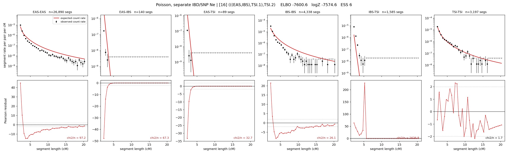

# `(((EAS,IBS),TSI.1),TSI.2)`

**Poisson, separate IBD/SNP Ne** | topology 16 of 21 | admixed leaf: **TSI** | 4 events, 8 nodes

> Graph where the two NON-admixed leaves merge first. Excluded by the 'first merge must involve an admixture branch' rule; included here because it is the standard local-clade + deep-source scenario.

## Model score

| quantity | value | |
|---|---|---|
| ELBO | -7600.65 | +- 0.36 (MC) |
| logZ (importance sampling) | -7574.59 | |
| ESS of the IS weights | 5.7 / 4000 | LOW -- treat logZ with suspicion |
| Stan dropped-constant correction | -29.78 | already applied |
| mode kept / MAP start / runtime | 1 / 11 | 20 s |
| mode search | 12/12 MAP starts succeeded | 3 distinct modes evaluated |

## Events (in temporal order, most recent first)

| # | type | detail | time (gen) | cumulative |
|---|---|---|---|---|
| 1 | ADMIXTURE | TSI -> TSI.1 + TSI.2 | 145.8 +- 3.0 | 145.8 |
| 2 | MERGE | EAS + IBS -> n1 | 87.9 +- 2.6 | 233.6 |
| 3 | MERGE | TSI.2 + n1 -> n2 | 3.1 +- 0.2 | 236.7 |
| 4 | MERGE | TSI.1 + n2 -> root | 49.6 +- 5.5 | 286.4 |

## Admixture fraction

**f = 0.447 +- 0.008** (fraction from `TSI.1`; 0.553 from `TSI.2`)

## Effective sizes for IBD (haploid)

| node | Ne | sd of log Ne |
|---|---|---|
| `EAS` | 1,233,928 | 0.02 |
| `IBS` | 254,231 | 0.04 |
| `TSI` | 416,499 | 0.04 |
| `TSI.1` | 47,903 | 0.10 |
| `TSI.2` | 8,518 | 0.08 |
| `n1` | 2,707 | 0.05 |
| `n2` | 2,717 | 0.04 |
| `root` | 14,714 | 0.08 |

log-Ne random-walk step scale tau_ibd = 1.301

## Effective sizes for SNP (haploid)

| node | Ne | sd of log Ne |
|---|---|---|
| `EAS` | 1,295 | 0.01 |
| `IBS` | 179,507 | 0.04 |
| `TSI` | 358,511 | 0.04 |
| `TSI.1` | 87,544 | 0.02 |
| `TSI.2` | 61,663 | 0.01 |
| `n1` | 35,094 | 0.01 |
| `n2` | 37,320 | 0.01 |
| `root` | 31,617 | 0.02 |

log-Ne random-walk step scale tau_snp = 0.911

## Fit quality by component

| component | log-likelihood | n terms | chi2/n |
|---|---|---|---|
| IBD | -7,443.7 | 222 | 310.62 |
| SNP | +36.5 | 6 | 2.38 |

IBD chi2/n uses Poisson counting variance; SNP chi2/n uses its block SEs. Values near 1 indicate residuals on the modeled noise scale.

## SNP covariance residuals `(w_hat - W_pred)/w_se`

| | EAS | IBS | TSI |
|---|---|---|---|
| **EAS** | -0.02 | -0.03 | +0.07 |
| **IBS** | -0.03 | -0.10 | +0.16 |
| **TSI** | +0.07 | +0.16 | -0.29 |

