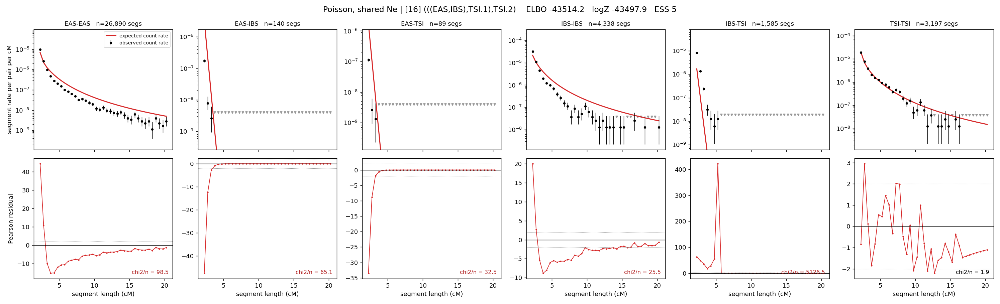

# `(((EAS,IBS),TSI.1),TSI.2)`

**Poisson, shared Ne** | topology 16 of 21 | admixed leaf: **TSI** | 4 events, 8 nodes

> Graph where the two NON-admixed leaves merge first. Excluded by the 'first merge must involve an admixture branch' rule; included here because it is the standard local-clade + deep-source scenario.

## Model score

| quantity | value | |
|---|---|---|
| ELBO | -43514.16 | +- 0.27 (MC) |
| logZ (importance sampling) | -43497.90 | |
| ESS of the IS weights | 4.9 / 4000 | LOW -- treat logZ with suspicion |
| Stan dropped-constant correction | -24.10 | already applied |
| mode kept / MAP start / runtime | 1 / 11 | 14 s |
| mode search | 10/12 MAP starts succeeded | 3 distinct modes evaluated |

## Events (in temporal order, most recent first)

| # | type | detail | time (gen) | cumulative |
|---|---|---|---|---|
| 1 | ADMIXTURE | TSI -> TSI.1 + TSI.2 | 212.8 +- 1.6 | 212.8 |
| 2 | MERGE | EAS + IBS -> n1 | 44.2 +- 0.3 | 257.0 |
| 3 | MERGE | TSI.2 + n1 -> n2 | 1.8 +- 0.0 | 258.8 |
| 4 | MERGE | TSI.1 + n2 -> root | 43.5 +- 0.5 | 302.3 |

## Admixture fraction

**f = 0.449 +- 0.003** (fraction from `TSI.1`; 0.551 from `TSI.2`)

## Effective sizes shared by IBD and SNP (haploid)

| node | Ne | sd of log Ne |
|---|---|---|
| `EAS` | 1,212,226 | 0.04 |
| `IBS` | 245,545 | 0.04 |
| `TSI` | 398,261 | 0.05 |
| `TSI.1` | 35,441 | 0.02 |
| `TSI.2` | 742 | 0.01 |
| `n1` | 1,026 | 0.02 |
| `n2` | 1,124 | 0.01 |
| `root` | 14,487 | 0.01 |

log-Ne random-walk step scale tau = 1.459

## Fit quality by component

| component | log-likelihood | n terms | chi2/n |
|---|---|---|---|
| IBD | -7,461.8 | 222 | 904.99 |
| SNP | -35,922.8 | 6 | 11988.82 |

IBD chi2/n uses Poisson counting variance; SNP chi2/n uses its block SEs. Values near 1 indicate residuals on the modeled noise scale.

## SNP covariance residuals `(w_hat - W_pred)/w_se`

| | EAS | IBS | TSI |
|---|---|---|---|
| **EAS** | +112.56 | -124.44 | -97.96 |
| **IBS** | -124.44 | +93.29 | +154.02 |
| **TSI** | -97.96 | +154.02 | +41.88 |

