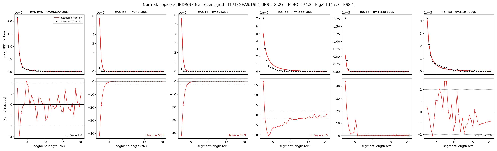

# `(((EAS,TSI.1),IBS),TSI.2)`

**Normal, separate IBD/SNP Ne, recent grid** | topology 17 of 21 | admixed leaf: **TSI** | 4 events, 8 nodes

> Recent Ne grid: 0-5 and 5-10 generations. The first demographic event is explicitly constrained to occur after generation 10 (minimum 11 with the current one-generation gap).

## Model score

| quantity | value | |
|---|---|---|
| ELBO | +74.34 | +- 0.55 (MC) |
| logZ (importance sampling) | +117.67 | |
| ESS of the IS weights | 1.0 / 4000 | LOW -- treat logZ with suspicion |
| Stan dropped-constant correction | -40.81 | already applied |
| mode kept / MAP start / runtime | 1 / 6 | 27 s |
| mode search | 12/12 MAP starts succeeded | 3 distinct modes evaluated |

## Events (in temporal order, most recent first)

| # | type | detail | time (gen) | cumulative |
|---|---|---|---|---|
| 1 | ADMIXTURE | TSI -> TSI.1 + TSI.2 | 112.1 +- 7.1 | 112.1 |
| 2 | MERGE | TSI.2 + EAS -> n1 | 21.7 +- 7.7 | 133.8 |
| 3 | MERGE | n1 + IBS -> n2 | 12.4 +- 0.8 | 146.2 |
| 4 | MERGE | TSI.1 + n2 -> root | 1.0 +- 0.0 | 147.2 |

## Admixture fraction

**f = 1.000 +- 0.000** (fraction from `TSI.1`; 0.000 from `TSI.2`)

Collapsed to a tree: one source carries <5% of the ancestry, so this graph is behaving as its no-admixture special case.

## Recent effective sizes for IBD (haploid)

| population | 0-5 gen | 5-10 gen |
|---|---:|---:|
| `EAS` | 3,967,118 | 3,841,710 |
| `IBS` | 3,958,571 | 2,272,119 |
| `TSI` | 1,252,022 | 810,449 |

## Effective sizes for IBD (haploid)

| node | Ne | sd of log Ne |
|---|---|---|
| `EAS` | 2,527,124 | 0.04 |
| `IBS` | 211,371 | 0.03 |
| `TSI` | 404,962 | 0.05 |
| `TSI.1` | 60,512 | 0.21 |
| `TSI.2` | 21,349 | 0.05 |
| `n1` | 18,197 | 0.08 |
| `n2` | 141,419 | 0.11 |
| `root` | 75,969 | 0.01 |

log-Ne random-walk step scale tau_ibd = 2.210

## Recent effective sizes for SNP (haploid)

| population | 0-5 gen | 5-10 gen |
|---|---:|---:|
| `EAS` | 552 | 628 |
| `IBS` | 118,883 | 132,549 |
| `TSI` | 97,576 | 96,946 |

## Effective sizes for SNP (haploid)

| node | Ne | sd of log Ne |
|---|---|---|
| `EAS` | 765 | 0.02 |
| `IBS` | 137,027 | 0.15 |
| `TSI` | 100,295 | 0.10 |
| `TSI.1` | 62,159 | 0.14 |
| `TSI.2` | 9,584 | 0.05 |
| `n1` | 8,768 | 0.07 |
| `n2` | 19,317 | 0.04 |
| `root` | 20,018 | 0.04 |

log-Ne random-walk step scale tau_snp = 1.078

## Fit quality by component

| component | log-likelihood | n terms | chi2/n |
|---|---|---|---|
| IBD | +339.2 | 222 | 35.31 |
| SNP | +31.9 | 6 | 3.89 |

IBD chi2/n uses Palamara model-derived Normal variance; SNP chi2/n uses its block SEs. Values near 1 indicate residuals on the modeled noise scale.

## SNP covariance residuals `(w_hat - W_pred)/w_se`

| | EAS | IBS | TSI |
|---|---|---|---|
| **EAS** | +0.00 | -0.25 | +0.25 |
| **IBS** | -0.25 | +0.29 | +0.20 |
| **TSI** | +0.25 | +0.20 | -0.67 |

