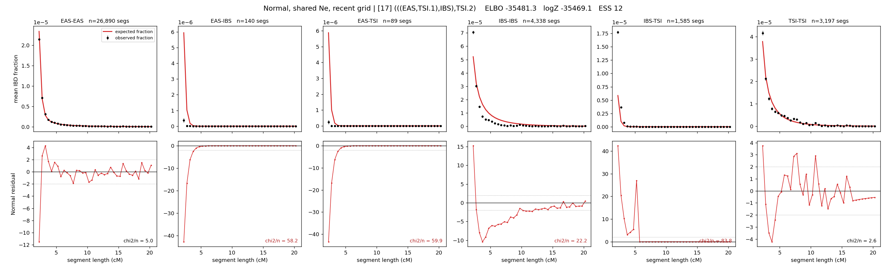

# `(((EAS,TSI.1),IBS),TSI.2)`

**Normal, shared Ne, recent grid** | topology 17 of 21 | admixed leaf: **TSI** | 4 events, 8 nodes

> Recent Ne grid: 0-5 and 5-10 generations. The first demographic event is explicitly constrained to occur after generation 10 (minimum 11 with the current one-generation gap).

## Model score

| quantity | value | |
|---|---|---|
| ELBO | -35481.35 | +- 0.16 (MC) |
| logZ (importance sampling) | -35469.08 | |
| ESS of the IS weights | 12.0 / 4000 | LOW -- treat logZ with suspicion |
| Stan dropped-constant correction | -29.61 | already applied |
| mode kept / MAP start / runtime | 1 / 3 | 28 s |
| mode search | 12/12 MAP starts succeeded | 3 distinct modes evaluated |

## Events (in temporal order, most recent first)

| # | type | detail | time (gen) | cumulative |
|---|---|---|---|---|
| 1 | ADMIXTURE | TSI -> TSI.1 + TSI.2 | 16.8 +- 0.1 | 16.8 |
| 2 | MERGE | TSI.2 + EAS -> n1 | 150.3 +- 0.3 | 167.1 |
| 3 | MERGE | n1 + IBS -> n2 | 3.3 +- 0.0 | 170.5 |
| 4 | MERGE | TSI.1 + n2 -> root | 1.0 +- 0.0 | 171.5 |

## Admixture fraction

**f = 0.999 +- 0.000** (fraction from `TSI.1`; 0.001 from `TSI.2`)

Collapsed to a tree: one source carries <5% of the ancestry, so this graph is behaving as its no-admixture special case.

## Recent effective sizes shared by IBD and SNP (haploid)

| population | 0-5 gen | 5-10 gen |
|---|---:|---:|
| `EAS` | 4,758,138 | 3,627,337 |
| `IBS` | 4,725,865 | 3,123,473 |
| `TSI` | 2,440,167 | 2,182,204 |

## Effective sizes shared by IBD and SNP (haploid)

| node | Ne | sd of log Ne |
|---|---|---|
| `EAS` | 2,389,413 | 0.02 |
| `IBS` | 209,978 | 0.02 |
| `TSI` | 1,406,044 | 0.05 |
| `TSI.1` | 296,864 | 0.02 |
| `TSI.2` | 0 | 0.03 |
| `n1` | 1,742 | 0.02 |
| `n2` | 73,619 | 0.01 |
| `root` | 32,853 | 0.01 |

log-Ne random-walk step scale tau = 2.839

## Fit quality by component

| component | log-likelihood | n terms | chi2/n |
|---|---|---|---|
| IBD | +15.2 | 222 | 38.69 |
| SNP | -35,259.8 | 6 | 11767.82 |

IBD chi2/n uses Palamara model-derived Normal variance; SNP chi2/n uses its block SEs. Values near 1 indicate residuals on the modeled noise scale.

## SNP covariance residuals `(w_hat - W_pred)/w_se`

| | EAS | IBS | TSI |
|---|---|---|---|
| **EAS** | +111.48 | -123.47 | -96.77 |
| **IBS** | -123.47 | +92.93 | +152.43 |
| **TSI** | -96.77 | +152.43 | +41.12 |

