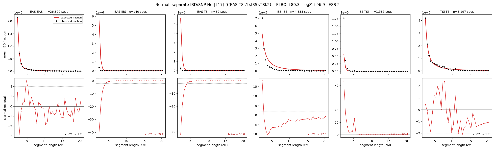

# `(((EAS,TSI.1),IBS),TSI.2)`

**Normal, separate IBD/SNP Ne** | topology 17 of 21 | admixed leaf: **TSI** | 4 events, 8 nodes

## Model score

| quantity | value | |
|---|---|---|
| ELBO | +80.25 | +- 0.20 (MC) |
| logZ (importance sampling) | +96.92 | |
| ESS of the IS weights | 1.9 / 4000 | LOW -- treat logZ with suspicion |
| Stan dropped-constant correction | -29.78 | already applied |
| mode kept / MAP start / runtime | 1 / 6 | 27 s |
| mode search | 12/12 MAP starts succeeded | 3 distinct modes evaluated |

## Events (in temporal order, most recent first)

| # | type | detail | time (gen) | cumulative |
|---|---|---|---|---|
| 1 | ADMIXTURE | TSI -> TSI.1 + TSI.2 | 109.3 +- 0.4 | 109.3 |
| 2 | MERGE | TSI.2 + EAS -> n1 | 22.1 +- 0.2 | 131.4 |
| 3 | MERGE | n1 + IBS -> n2 | 14.7 +- 0.1 | 146.1 |
| 4 | MERGE | TSI.1 + n2 -> root | 1.0 +- 0.0 | 147.1 |

## Admixture fraction

**f = 1.000 +- 0.000** (fraction from `TSI.1`; 0.000 from `TSI.2`)

Collapsed to a tree: one source carries <5% of the ancestry, so this graph is behaving as its no-admixture special case.

## Effective sizes for IBD (haploid)

| node | Ne | sd of log Ne |
|---|---|---|
| `EAS` | 2,653,205 | 0.03 |
| `IBS` | 219,355 | 0.03 |
| `TSI` | 426,465 | 0.05 |
| `TSI.1` | 62,403 | 0.02 |
| `TSI.2` | 25,906 | 0.03 |
| `n1` | 22,136 | 0.03 |
| `n2` | 98,609 | 0.01 |
| `root` | 76,114 | 0.01 |

log-Ne random-walk step scale tau_ibd = 1.479

## Effective sizes for SNP (haploid)

| node | Ne | sd of log Ne |
|---|---|---|
| `EAS` | 734 | 0.01 |
| `IBS` | 110,965 | 0.08 |
| `TSI` | 108,131 | 0.02 |
| `TSI.1` | 63,019 | 0.02 |
| `TSI.2` | 9,387 | 0.01 |
| `n1` | 11,337 | 0.01 |
| `n2` | 18,533 | 0.01 |
| `root` | 18,760 | 0.01 |

log-Ne random-walk step scale tau_snp = 0.965

## Fit quality by component

| component | log-likelihood | n terms | chi2/n |
|---|---|---|---|
| IBD | +238.4 | 222 | 36.09 |
| SNP | +39.6 | 6 | 1.34 |

IBD chi2/n uses Palamara model-derived Normal variance; SNP chi2/n uses its block SEs. Values near 1 indicate residuals on the modeled noise scale.

## SNP covariance residuals `(w_hat - W_pred)/w_se`

| | EAS | IBS | TSI |
|---|---|---|---|
| **EAS** | +0.09 | -0.19 | +0.02 |
| **IBS** | -0.19 | -0.11 | +0.50 |
| **TSI** | +0.02 | +0.50 | -0.50 |

