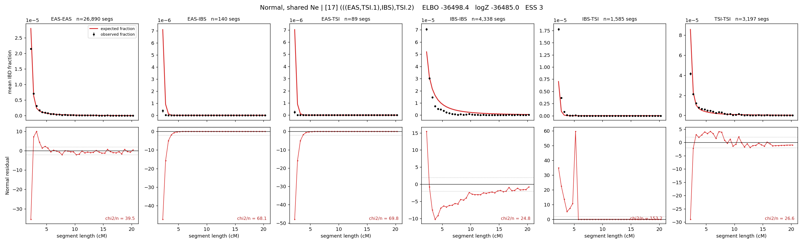

# `(((EAS,TSI.1),IBS),TSI.2)`

**Normal, shared Ne** | topology 17 of 21 | admixed leaf: **TSI** | 4 events, 8 nodes

## Model score

| quantity | value | |
|---|---|---|
| ELBO | -36498.39 | +- 0.15 (MC) |
| logZ (importance sampling) | -36484.99 | |
| ESS of the IS weights | 2.9 / 4000 | LOW -- treat logZ with suspicion |
| Stan dropped-constant correction | -24.10 | already applied |
| mode kept / MAP start / runtime | 3 / 6 | 20 s |
| mode search | 12/12 MAP starts succeeded | 3 distinct modes evaluated |

## Events (in temporal order, most recent first)

| # | type | detail | time (gen) | cumulative |
|---|---|---|---|---|
| 1 | ADMIXTURE | TSI -> TSI.1 + TSI.2 | 197.6 +- 0.5 | 197.6 |
| 2 | MERGE | TSI.2 + EAS -> n1 | 1.0 +- 0.0 | 198.6 |
| 3 | MERGE | n1 + IBS -> n2 | 1.5 +- 0.2 | 200.2 |
| 4 | MERGE | TSI.1 + n2 -> root | 1.0 +- 0.0 | 201.2 |

## Admixture fraction

**f = 1.000 +- 0.000** (fraction from `TSI.1`; 0.000 from `TSI.2`)

Collapsed to a tree: one source carries <5% of the ancestry, so this graph is behaving as its no-admixture special case.

## Effective sizes shared by IBD and SNP (haploid)

| node | Ne | sd of log Ne |
|---|---|---|
| `EAS` | 2,536,487 | 0.04 |
| `IBS` | 221,230 | 0.03 |
| `TSI` | 555,496 | 0.05 |
| `TSI.1` | 148 | 0.05 |
| `TSI.2` | 245 | 0.13 |
| `n1` | 233 | 0.13 |
| `n2` | 31,045 | 0.08 |
| `root` | 9,940 | 0.01 |

log-Ne random-walk step scale tau = 3.587

## Fit quality by component

| component | log-likelihood | n terms | chi2/n |
|---|---|---|---|
| IBD | -2,747.6 | 222 | 63.77 |
| SNP | -33,469.8 | 6 | 11171.13 |

IBD chi2/n uses Palamara model-derived Normal variance; SNP chi2/n uses its block SEs. Values near 1 indicate residuals on the modeled noise scale.

## SNP covariance residuals `(w_hat - W_pred)/w_se`

| | EAS | IBS | TSI |
|---|---|---|---|
| **EAS** | +109.19 | -118.75 | -97.00 |
| **IBS** | -118.75 | +92.78 | +142.95 |
| **TSI** | -97.00 | +142.95 | +50.47 |

