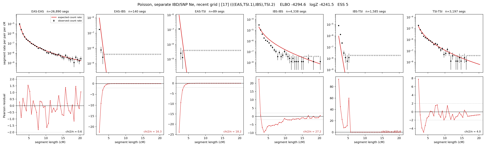

# `(((EAS,TSI.1),IBS),TSI.2)`

**Poisson, separate IBD/SNP Ne, recent grid** | topology 17 of 21 | admixed leaf: **TSI** | 4 events, 8 nodes

> Recent Ne grid: 0-5 and 5-10 generations. The first demographic event is explicitly constrained to occur after generation 10 (minimum 11 with the current one-generation gap).

## Model score

| quantity | value | |
|---|---|---|
| ELBO | -4294.57 | +- 0.61 (MC) |
| logZ (importance sampling) | -4241.55 | |
| ESS of the IS weights | 4.5 / 4000 | LOW -- treat logZ with suspicion |
| Stan dropped-constant correction | -40.81 | already applied |
| seed kept / runtime | 7 | 23 s |

## Events (in temporal order, most recent first)

| # | type | detail | time (gen) | cumulative |
|---|---|---|---|---|
| 1 | ADMIXTURE | TSI -> TSI.1 + TSI.2 | 11.0 +- 0.0 | 11.0 |
| 2 | MERGE | TSI.2 + EAS -> n1 | 124.4 +- 0.7 | 135.4 |
| 3 | MERGE | n1 + IBS -> n2 | 44.2 +- 0.4 | 179.6 |
| 4 | MERGE | TSI.1 + n2 -> root | 1.0 +- 0.0 | 180.6 |

## Admixture fraction

**f = 1.000 +- 0.000** (fraction from `TSI.1`; 0.000 from `TSI.2`)

Collapsed to a tree: one source carries <5% of the ancestry, so this graph is behaving as its no-admixture special case.

## Recent effective sizes for IBD (haploid)

| population | 0-5 gen | 5-10 gen |
|---|---:|---:|
| `EAS` | 4,080,049 | 3,832,915 |
| `IBS` | 4,447,065 | 2,817,563 |
| `TSI` | 2,894,330 | 2,029,508 |

## Effective sizes for IBD (haploid)

| node | Ne | sd of log Ne |
|---|---|---|
| `EAS` | 2,418,072 | 0.03 |
| `IBS` | 223,309 | 0.02 |
| `TSI` | 474,552 | 0.07 |
| `TSI.1` | 304,048 | 0.07 |
| `TSI.2` | 33,733 | 0.03 |
| `n1` | 30,830 | 0.03 |
| `n2` | 125,432 | 0.01 |
| `root` | 67,713 | 0.01 |

log-Ne random-walk step scale tau_ibd = 2.228

## Recent effective sizes for SNP (haploid)

| population | 0-5 gen | 5-10 gen |
|---|---:|---:|
| `EAS` | 927 | 906 |
| `IBS` | 152,983 | 149,073 |
| `TSI` | 148,343 | 145,622 |

## Effective sizes for SNP (haploid)

| node | Ne | sd of log Ne |
|---|---|---|
| `EAS` | 810 | 0.02 |
| `IBS` | 131,936 | 0.07 |
| `TSI` | 135,945 | 0.06 |
| `TSI.1` | 132,980 | 0.06 |
| `TSI.2` | 3,107 | 0.01 |
| `n1` | 3,017 | 0.01 |
| `n2` | 17,457 | 0.01 |
| `root` | 17,310 | 0.01 |

log-Ne random-walk step scale tau_snp = 0.996

## Fit quality by component

| component | log-likelihood | n terms | chi2/n |
|---|---|---|---|
| IBD | -4,013.9 | 222 | 79.06 |
| SNP | +36.1 | 6 | 2.49 |

IBD chi2/n uses Poisson counting variance; SNP chi2/n uses its block SEs. Values near 1 indicate residuals on the modeled noise scale.

## SNP covariance residuals `(w_hat - W_pred)/w_se`

| | EAS | IBS | TSI |
|---|---|---|---|
| **EAS** | +0.00 | +0.04 | -0.04 |
| **IBS** | +0.04 | -0.15 | +0.09 |
| **TSI** | -0.04 | +0.09 | -0.00 |

