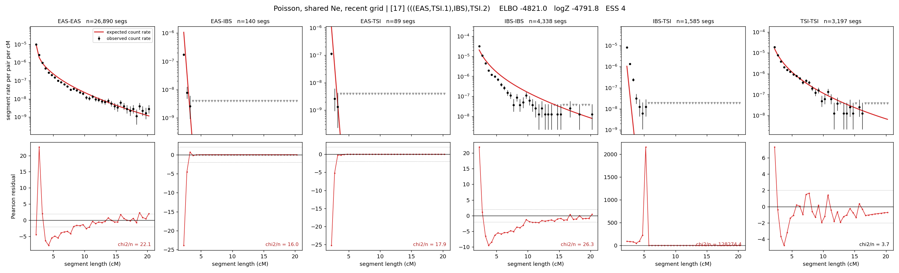

# `(((EAS,TSI.1),IBS),TSI.2)`

**Poisson, shared Ne, recent grid** | topology 17 of 21 | admixed leaf: **TSI** | 4 events, 8 nodes

> Recent Ne grid: 0-5 and 5-10 generations. The first demographic event is explicitly constrained to occur after generation 10 (minimum 11 with the current one-generation gap).

## Model score

| quantity | value | |
|---|---|---|
| ELBO | -4821.01 | +- 0.37 (MC) |
| logZ (importance sampling) | -4791.80 | |
| ESS of the IS weights | 3.8 / 4000 | LOW -- treat logZ with suspicion |
| Stan dropped-constant correction | -29.61 | already applied |
| seed kept / runtime | 7 | 22 s |

## Events (in temporal order, most recent first)

| # | type | detail | time (gen) | cumulative |
|---|---|---|---|---|
| 1 | ADMIXTURE | TSI -> TSI.1 + TSI.2 | 11.0 +- 0.0 | 11.0 |
| 2 | MERGE | TSI.2 + EAS -> n1 | 282.0 +- 0.5 | 293.0 |
| 3 | MERGE | n1 + IBS -> n2 | 8.6 +- 0.1 | 301.5 |
| 4 | MERGE | TSI.1 + n2 -> root | 1.0 +- 0.0 | 302.5 |

## Admixture fraction

**f = 1.000 +- 0.000** (fraction from `TSI.1`; 0.000 from `TSI.2`)

Collapsed to a tree: one source carries <5% of the ancestry, so this graph is behaving as its no-admixture special case.

## Recent effective sizes shared by IBD and SNP (haploid)

| population | 0-5 gen | 5-10 gen |
|---|---:|---:|
| `EAS` | 23,814,413 | 14,948,415 |
| `IBS` | 3,957,338 | 2,411,416 |
| `TSI` | 2,481,037 | 1,750,568 |

## Effective sizes shared by IBD and SNP (haploid)

| node | Ne | sd of log Ne |
|---|---|---|
| `EAS` | 1,585,455 | 0.03 |
| `IBS` | 225,330 | 0.03 |
| `TSI` | 468,300 | 0.06 |
| `TSI.1` | 305,882 | 0.05 |
| `TSI.2` | 112 | 0.04 |
| `n1` | 48 | 0.02 |
| `n2` | 1,557 | 0.03 |
| `root` | 808 | 0.02 |

log-Ne random-walk step scale tau = 2.713

## Fit quality by component

| component | log-likelihood | n terms | chi2/n |
|---|---|---|---|
| IBD | -4,618.6 | 222 | 21438.21 |
| SNP | +34.2 | 6 | 3.13 |

IBD chi2/n uses Poisson counting variance; SNP chi2/n uses its block SEs. Values near 1 indicate residuals on the modeled noise scale.

## SNP covariance residuals `(w_hat - W_pred)/w_se`

| | EAS | IBS | TSI |
|---|---|---|---|
| **EAS** | +0.23 | -0.24 | -0.22 |
| **IBS** | -0.24 | -0.02 | +0.52 |
| **TSI** | -0.22 | +0.52 | -0.06 |

