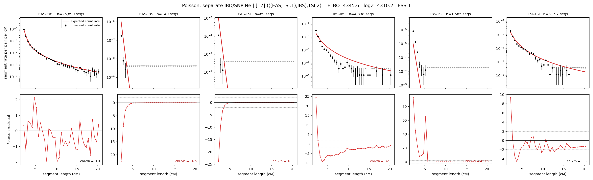

# `(((EAS,TSI.1),IBS),TSI.2)`

**Poisson, separate IBD/SNP Ne** | topology 17 of 21 | admixed leaf: **TSI** | 4 events, 8 nodes

## Model score

| quantity | value | |
|---|---|---|
| ELBO | -4345.58 | +- 0.39 (MC) |
| logZ (importance sampling) | -4310.16 | |
| ESS of the IS weights | 1.0 / 4000 | LOW -- treat logZ with suspicion |
| Stan dropped-constant correction | -29.78 | already applied |
| seed kept / runtime | 1 | 17 s |

## Events (in temporal order, most recent first)

| # | type | detail | time (gen) | cumulative |
|---|---|---|---|---|
| 1 | ADMIXTURE | TSI -> TSI.1 + TSI.2 | 1.8 +- 0.2 | 1.8 |
| 2 | MERGE | TSI.2 + EAS -> n1 | 128.0 +- 1.5 | 129.9 |
| 3 | MERGE | n1 + IBS -> n2 | 53.2 +- 2.1 | 183.0 |
| 4 | MERGE | TSI.1 + n2 -> root | 1.0 +- 0.0 | 184.0 |

## Admixture fraction

**f = 1.000 +- 0.000** (fraction from `TSI.1`; 0.000 from `TSI.2`)

Collapsed to a tree: one source carries <5% of the ancestry, so this graph is behaving as its no-admixture special case.

## Effective sizes for IBD (haploid)

| node | Ne | sd of log Ne |
|---|---|---|
| `EAS` | 2,575,960 | 0.04 |
| `IBS` | 235,468 | 0.04 |
| `TSI` | 324,004 | 0.02 |
| `TSI.1` | 320,187 | 0.02 |
| `TSI.2` | 38,866 | 0.05 |
| `n1` | 38,969 | 0.05 |
| `n2` | 77,342 | 0.03 |
| `root` | 59,857 | 0.03 |

log-Ne random-walk step scale tau_ibd = 1.203

## Effective sizes for SNP (haploid)

| node | Ne | sd of log Ne |
|---|---|---|
| `EAS` | 773 | 0.03 |
| `IBS` | 138,112 | 0.05 |
| `TSI` | 128,030 | 0.07 |
| `TSI.1` | 128,160 | 0.07 |
| `TSI.2` | 4,576 | 0.25 |
| `n1` | 4,587 | 0.25 |
| `n2` | 16,539 | 0.01 |
| `root` | 16,846 | 0.01 |

log-Ne random-walk step scale tau_snp = 0.950

## Fit quality by component

| component | log-likelihood | n terms | chi2/n |
|---|---|---|---|
| IBD | -4,180.1 | 222 | 84.11 |
| SNP | +35.7 | 6 | 2.64 |

IBD chi2/n uses Poisson counting variance; SNP chi2/n uses its block SEs. Values near 1 indicate residuals on the modeled noise scale.

## SNP covariance residuals `(w_hat - W_pred)/w_se`

| | EAS | IBS | TSI |
|---|---|---|---|
| **EAS** | -0.02 | -0.00 | +0.04 |
| **IBS** | -0.00 | -0.14 | +0.15 |
| **TSI** | +0.04 | +0.15 | -0.22 |

