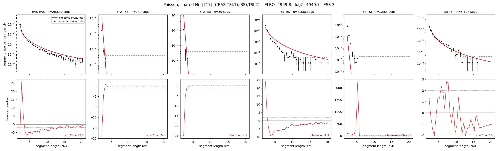

# `(((EAS,TSI.1),IBS),TSI.2)`

**Poisson, shared Ne** | topology 17 of 21 | admixed leaf: **TSI** | 4 events, 8 nodes

## Model score

| quantity | value | |
|---|---|---|
| ELBO | -4959.83 | +- 0.13 (MC) |
| logZ (importance sampling) | -4949.65 | |
| ESS of the IS weights | 3.2 / 4000 | LOW -- treat logZ with suspicion |
| Stan dropped-constant correction | -24.10 | already applied |
| mode kept / MAP start / runtime | 1 / 3 | 19 s |
| mode search | 10/12 MAP starts succeeded | 3 distinct modes evaluated |

## Events (in temporal order, most recent first)

| # | type | detail | time (gen) | cumulative |
|---|---|---|---|---|
| 1 | ADMIXTURE | TSI -> TSI.1 + TSI.2 | 78.7 +- 0.2 | 78.7 |
| 2 | MERGE | TSI.2 + EAS -> n1 | 211.2 +- 0.4 | 289.9 |
| 3 | MERGE | n1 + IBS -> n2 | 12.8 +- 0.0 | 302.6 |
| 4 | MERGE | TSI.1 + n2 -> root | 1.1 +- 0.0 | 303.7 |

## Admixture fraction

**f = 1.000 +- 0.000** (fraction from `TSI.1`; 0.000 from `TSI.2`)

Collapsed to a tree: one source carries <5% of the ancestry, so this graph is behaving as its no-admixture special case.

## Effective sizes shared by IBD and SNP (haploid)

| node | Ne | sd of log Ne |
|---|---|---|
| `EAS` | 1,724,997 | 0.03 |
| `IBS` | 236,974 | 0.02 |
| `TSI` | 450,307 | 0.03 |
| `TSI.1` | 139,180 | 0.02 |
| `TSI.2` | 3,331 | 0.08 |
| `n1` | 71 | 0.01 |
| `n2` | 1,632 | 0.01 |
| `root` | 776 | 0.01 |

log-Ne random-walk step scale tau = 1.964

## Fit quality by component

| component | log-likelihood | n terms | chi2/n |
|---|---|---|---|
| IBD | -4,821.7 | 222 | 23158.01 |
| SNP | +36.3 | 6 | 2.45 |

IBD chi2/n uses Poisson counting variance; SNP chi2/n uses its block SEs. Values near 1 indicate residuals on the modeled noise scale.

## SNP covariance residuals `(w_hat - W_pred)/w_se`

| | EAS | IBS | TSI |
|---|---|---|---|
| **EAS** | +0.42 | -0.92 | +0.09 |
| **IBS** | -0.92 | -0.05 | +1.94 |
| **TSI** | +0.09 | +1.94 | -1.99 |

