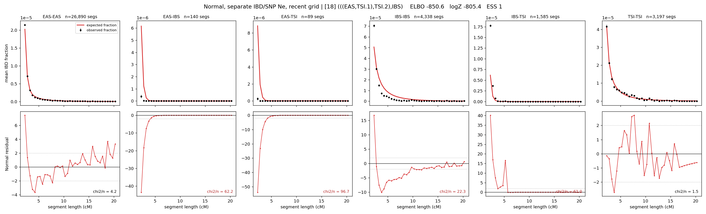

# `(((EAS,TSI.1),TSI.2),IBS)`

**Normal, separate IBD/SNP Ne, recent grid** | topology 18 of 21 | admixed leaf: **TSI** | 4 events, 8 nodes

> Recent Ne grid: 0-5 and 5-10 generations. The first demographic event is explicitly constrained to occur after generation 10 (minimum 11 with the current one-generation gap).

## Model score

| quantity | value | |
|---|---|---|
| ELBO | -850.60 | +- 0.36 (MC) |
| logZ (importance sampling) | -805.38 | |
| ESS of the IS weights | 1.0 / 4000 | LOW -- treat logZ with suspicion |
| Stan dropped-constant correction | -40.81 | already applied |
| seed kept / runtime | 1 | 23 s |

## Events (in temporal order, most recent first)

| # | type | detail | time (gen) | cumulative |
|---|---|---|---|---|
| 1 | ADMIXTURE | TSI -> TSI.1 + TSI.2 | 148.1 +- 0.6 | 148.1 |
| 2 | MERGE | TSI.2 + EAS -> n1 | 5.8 +- 0.1 | 153.9 |
| 3 | MERGE | TSI.1 + n1 -> n2 | 1.1 +- 0.0 | 155.0 |
| 4 | MERGE | n2 + IBS -> root | 1.1 +- 0.0 | 156.1 |

## Admixture fraction

**f = 0.935 +- 0.002** (fraction from `TSI.1`; 0.065 from `TSI.2`)

## Recent effective sizes for IBD (haploid)

| population | 0-5 gen | 5-10 gen |
|---|---:|---:|
| `EAS` | 4,796,470,688 | 2,615,338,203 |
| `IBS` | 218,171,465 | 77,041,428 |
| `TSI` | 3,018,455 | 13,242,864 |

## Effective sizes for IBD (haploid)

| node | Ne | sd of log Ne |
|---|---|---|
| `EAS` | 1,960,725 | 0.05 |
| `IBS` | 215,435 | 0.03 |
| `TSI` | 365,991 | 0.06 |
| `TSI.1` | 9,964 | 0.04 |
| `TSI.2` | 15,499,668 | 0.14 |
| `n1` | 1,800 | 0.05 |
| `n2` | 5,276 | 0.04 |
| `root` | 51,929 | 0.02 |

log-Ne random-walk step scale tau_ibd = 5.976

## Recent effective sizes for SNP (haploid)

| population | 0-5 gen | 5-10 gen |
|---|---:|---:|
| `EAS` | 187 | 250 |
| `IBS` | 54,007 | 68,936 |
| `TSI` | 223,538,843 | 377,223,006 |

## Effective sizes for SNP (haploid)

| node | Ne | sd of log Ne |
|---|---|---|
| `EAS` | 1,066 | 0.01 |
| `IBS` | 263,350 | 0.06 |
| `TSI` | 103,585,372 | 0.06 |
| `TSI.1` | 173,070 | 0.01 |
| `TSI.2` | 4,101,450 | 0.06 |
| `n1` | 282,498 | 0.01 |
| `n2` | 182,377 | 0.01 |
| `root` | 130,846 | 0.01 |

log-Ne random-walk step scale tau_snp = 1.685

## Fit quality by component

| component | log-likelihood | n terms | chi2/n |
|---|---|---|---|
| IBD | -321.8 | 222 | 41.43 |
| SNP | +25.3 | 6 | 6.12 |

IBD chi2/n uses Palamara model-derived Normal variance; SNP chi2/n uses its block SEs. Values near 1 indicate residuals on the modeled noise scale.

## SNP covariance residuals `(w_hat - W_pred)/w_se`

| | EAS | IBS | TSI |
|---|---|---|---|
| **EAS** | -0.52 | +0.90 | +0.11 |
| **IBS** | +0.90 | +1.44 | -3.38 |
| **TSI** | +0.11 | -3.38 | +2.96 |

