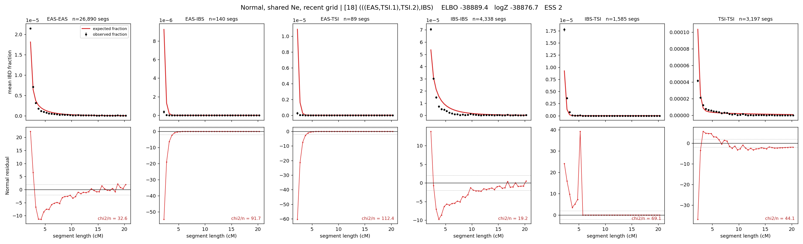

# `(((EAS,TSI.1),TSI.2),IBS)`

**Normal, shared Ne, recent grid** | topology 18 of 21 | admixed leaf: **TSI** | 4 events, 8 nodes

> Recent Ne grid: 0-5 and 5-10 generations. The first demographic event is explicitly constrained to occur after generation 10 (minimum 11 with the current one-generation gap).

## Model score

| quantity | value | |
|---|---|---|
| ELBO | -38889.42 | +- 0.15 (MC) |
| logZ (importance sampling) | -38876.68 | |
| ESS of the IS weights | 1.6 / 4000 | LOW -- treat logZ with suspicion |
| Stan dropped-constant correction | -29.61 | already applied |
| seed kept / runtime | 1 | 13 s |

## Events (in temporal order, most recent first)

| # | type | detail | time (gen) | cumulative |
|---|---|---|---|---|
| 1 | ADMIXTURE | TSI -> TSI.1 + TSI.2 | 187.6 +- 0.5 | 187.6 |
| 2 | MERGE | TSI.2 + EAS -> n1 | 2.1 +- 0.0 | 189.7 |
| 3 | MERGE | TSI.1 + n1 -> n2 | 1.0 +- 0.0 | 190.7 |
| 4 | MERGE | n2 + IBS -> root | 1.0 +- 0.0 | 191.7 |

## Admixture fraction

**f = 0.002 +- 0.000** (fraction from `TSI.1`; 0.998 from `TSI.2`)

Collapsed to a tree: one source carries <5% of the ancestry, so this graph is behaving as its no-admixture special case.

## Recent effective sizes shared by IBD and SNP (haploid)

| population | 0-5 gen | 5-10 gen |
|---|---:|---:|
| `EAS` | 46,020,172 | 25,744,669 |
| `IBS` | 6,077,896 | 3,614,299 |
| `TSI` | 234,273 | 78,050 |

## Effective sizes shared by IBD and SNP (haploid)

| node | Ne | sd of log Ne |
|---|---|---|
| `EAS` | 1,353,729 | 0.02 |
| `IBS` | 220,867 | 0.04 |
| `TSI` | 1,073,851 | 0.05 |
| `TSI.1` | 6,892 | 0.01 |
| `TSI.2` | 92 | 0.03 |
| `n1` | 3,176 | 0.01 |
| `n2` | 6,382 | 0.01 |
| `root` | 10,495 | 0.01 |

log-Ne random-walk step scale tau = 3.283

## Fit quality by component

| component | log-likelihood | n terms | chi2/n |
|---|---|---|---|
| IBD | -2,531.2 | 222 | 61.59 |
| SNP | -36,112.3 | 6 | 12051.97 |

IBD chi2/n uses Palamara model-derived Normal variance; SNP chi2/n uses its block SEs. Values near 1 indicate residuals on the modeled noise scale.

## SNP covariance residuals `(w_hat - W_pred)/w_se`

| | EAS | IBS | TSI |
|---|---|---|---|
| **EAS** | +113.65 | -122.21 | -102.36 |
| **IBS** | -122.21 | +96.77 | +145.73 |
| **TSI** | -102.36 | +145.73 | +58.08 |

