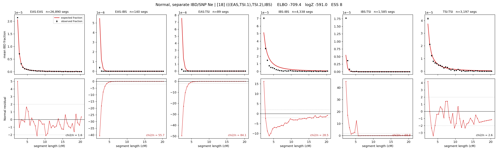

# `(((EAS,TSI.1),TSI.2),IBS)`

**Normal, separate IBD/SNP Ne** | topology 18 of 21 | admixed leaf: **TSI** | 4 events, 8 nodes

## Model score

| quantity | value | |
|---|---|---|
| ELBO | -709.38 | +- 2.58 (MC) |
| logZ (importance sampling) | -590.97 | |
| ESS of the IS weights | 7.6 / 4000 | LOW -- treat logZ with suspicion |
| Stan dropped-constant correction | -29.78 | already applied |
| seed kept / runtime | 13 | 17 s |

## Events (in temporal order, most recent first)

| # | type | detail | time (gen) | cumulative |
|---|---|---|---|---|
| 1 | ADMIXTURE | TSI -> TSI.1 + TSI.2 | 116.2 +- 0.3 | 116.2 |
| 2 | MERGE | TSI.2 + EAS -> n1 | 25.8 +- 0.4 | 142.0 |
| 3 | MERGE | TSI.1 + n1 -> n2 | 1.0 +- 0.0 | 143.0 |
| 4 | MERGE | n2 + IBS -> root | 1.0 +- 0.0 | 144.0 |

## Admixture fraction

**f = 0.959 +- 0.002** (fraction from `TSI.1`; 0.041 from `TSI.2`)

Collapsed to a tree: one source carries <5% of the ancestry, so this graph is behaving as its no-admixture special case.

## Effective sizes for IBD (haploid)

| node | Ne | sd of log Ne |
|---|---|---|
| `EAS` | 2,511,922 | 0.05 |
| `IBS` | 215,394 | 0.19 |
| `TSI` | 365,728 | 0.12 |
| `TSI.1` | 105,820 | 0.06 |
| `TSI.2` | 2,077,730 | 0.05 |
| `n1` | 1,711 | 0.05 |
| `n2` | 9,347 | 0.04 |
| `root` | 86,798 | 0.03 |

log-Ne random-walk step scale tau_ibd = 3.914

## Effective sizes for SNP (haploid)

| node | Ne | sd of log Ne |
|---|---|---|
| `EAS` | 784 | 0.02 |
| `IBS` | 4,236,820,044 | 0.13 |
| `TSI` | 82,043 | 0.37 |
| `TSI.1` | 207,206 | 0.03 |
| `TSI.2` | 1,070,706,606 | 0.08 |
| `n1` | 229,440 | 0.03 |
| `n2` | 152,898 | 0.02 |
| `root` | 95,812 | 0.02 |

log-Ne random-walk step scale tau_snp = 3.704

## Fit quality by component

| component | log-likelihood | n terms | chi2/n |
|---|---|---|---|
| IBD | -328.3 | 222 | 41.04 |
| SNP | +16.6 | 6 | 9.00 |

IBD chi2/n uses Palamara model-derived Normal variance; SNP chi2/n uses its block SEs. Values near 1 indicate residuals on the modeled noise scale.

## SNP covariance residuals `(w_hat - W_pred)/w_se`

| | EAS | IBS | TSI |
|---|---|---|---|
| **EAS** | -0.31 | -0.46 | +1.09 |
| **IBS** | -0.46 | +2.50 | -1.74 |
| **TSI** | +1.09 | -1.74 | -0.44 |

