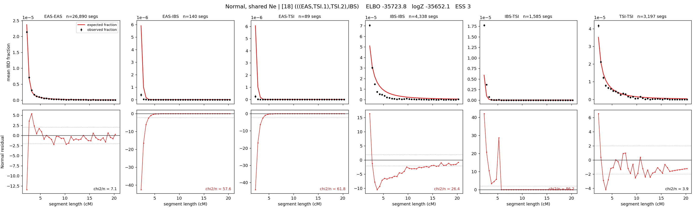

# `(((EAS,TSI.1),TSI.2),IBS)`

**Normal, shared Ne** | topology 18 of 21 | admixed leaf: **TSI** | 4 events, 8 nodes

## Model score

| quantity | value | |
|---|---|---|
| ELBO | -35723.80 | +- 1.13 (MC) |
| logZ (importance sampling) | -35652.07 | |
| ESS of the IS weights | 2.5 / 4000 | LOW -- treat logZ with suspicion |
| Stan dropped-constant correction | -24.10 | already applied |
| mode kept / MAP start / runtime | 1 / 2 | 19 s |
| mode search | 12/12 MAP starts succeeded | 3 distinct modes evaluated |

## Events (in temporal order, most recent first)

| # | type | detail | time (gen) | cumulative |
|---|---|---|---|---|
| 1 | ADMIXTURE | TSI -> TSI.1 + TSI.2 | 153.3 +- 6.1 | 153.3 |
| 2 | MERGE | TSI.2 + EAS -> n1 | 18.2 +- 4.5 | 171.5 |
| 3 | MERGE | TSI.1 + n1 -> n2 | 1.2 +- 0.1 | 172.7 |
| 4 | MERGE | n2 + IBS -> root | 1.0 +- 0.0 | 173.7 |

## Admixture fraction

**f = 0.999 +- 0.000** (fraction from `TSI.1`; 0.001 from `TSI.2`)

Collapsed to a tree: one source carries <5% of the ancestry, so this graph is behaving as its no-admixture special case.

## Effective sizes shared by IBD and SNP (haploid)

| node | Ne | sd of log Ne |
|---|---|---|
| `EAS` | 2,477,911 | 0.05 |
| `IBS` | 218,247 | 0.05 |
| `TSI` | 334,736 | 0.08 |
| `TSI.1` | 1,320,539 | 0.05 |
| `TSI.2` | 0 | 0.07 |
| `n1` | 538 | 0.12 |
| `n2` | 47,800 | 0.21 |
| `root` | 30,335 | 0.06 |

log-Ne random-walk step scale tau = 3.613

## Fit quality by component

| component | log-likelihood | n terms | chi2/n |
|---|---|---|---|
| IBD | -251.9 | 222 | 40.90 |
| SNP | -35,159.6 | 6 | 11734.39 |

IBD chi2/n uses Palamara model-derived Normal variance; SNP chi2/n uses its block SEs. Values near 1 indicate residuals on the modeled noise scale.

## SNP covariance residuals `(w_hat - W_pred)/w_se`

| | EAS | IBS | TSI |
|---|---|---|---|
| **EAS** | +111.30 | -123.23 | -96.67 |
| **IBS** | -123.23 | +92.70 | +152.20 |
| **TSI** | -96.67 | +152.20 | +41.15 |

