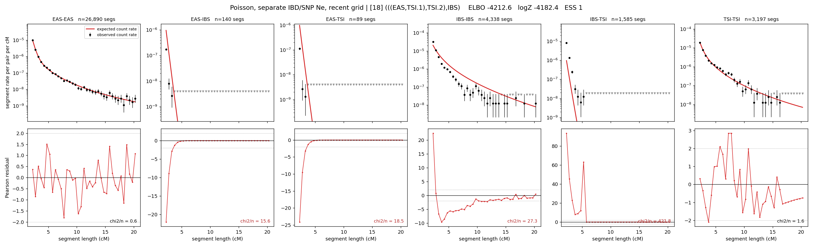

# `(((EAS,TSI.1),TSI.2),IBS)`

**Poisson, separate IBD/SNP Ne, recent grid** | topology 18 of 21 | admixed leaf: **TSI** | 4 events, 8 nodes

> Recent Ne grid: 0-5 and 5-10 generations. The first demographic event is explicitly constrained to occur after generation 10 (minimum 11 with the current one-generation gap).

## Model score

| quantity | value | |
|---|---|---|
| ELBO | -4212.65 | +- 0.37 (MC) |
| logZ (importance sampling) | -4182.36 | |
| ESS of the IS weights | 1.4 / 4000 | LOW -- treat logZ with suspicion |
| Stan dropped-constant correction | -40.81 | already applied |
| mode kept / MAP start / runtime | 1 / 6 | 24 s |
| mode search | 12/12 MAP starts succeeded | 3 distinct modes evaluated |

## Events (in temporal order, most recent first)

| # | type | detail | time (gen) | cumulative |
|---|---|---|---|---|
| 1 | ADMIXTURE | TSI -> TSI.1 + TSI.2 | 112.4 +- 0.7 | 112.4 |
| 2 | MERGE | TSI.2 + EAS -> n1 | 22.5 +- 0.1 | 134.9 |
| 3 | MERGE | TSI.1 + n1 -> n2 | 46.3 +- 0.5 | 181.3 |
| 4 | MERGE | n2 + IBS -> root | 1.1 +- 0.0 | 182.3 |

## Admixture fraction

**f = 1.000 +- 0.000** (fraction from `TSI.1`; 0.000 from `TSI.2`)

Collapsed to a tree: one source carries <5% of the ancestry, so this graph is behaving as its no-admixture special case.

## Recent effective sizes for IBD (haploid)

| population | 0-5 gen | 5-10 gen |
|---|---:|---:|
| `EAS` | 3,975,427 | 4,015,618 |
| `IBS` | 3,363,494 | 2,202,178 |
| `TSI` | 1,749,295 | 1,141,863 |

## Effective sizes for IBD (haploid)

| node | Ne | sd of log Ne |
|---|---|---|
| `EAS` | 2,408,001 | 0.03 |
| `IBS` | 223,322 | 0.02 |
| `TSI` | 404,733 | 0.11 |
| `TSI.1` | 63,922 | 0.05 |
| `TSI.2` | 37,702 | 0.02 |
| `n1` | 32,009 | 0.02 |
| `n2` | 113,316 | 0.02 |
| `root` | 64,413 | 0.01 |

log-Ne random-walk step scale tau_ibd = 2.073

## Recent effective sizes for SNP (haploid)

| population | 0-5 gen | 5-10 gen |
|---|---:|---:|
| `EAS` | 731 | 781 |
| `IBS` | 139,687 | 139,968 |
| `TSI` | 150,517 | 153,411 |

## Effective sizes for SNP (haploid)

| node | Ne | sd of log Ne |
|---|---|---|
| `EAS` | 789 | 0.02 |
| `IBS` | 144,904 | 0.04 |
| `TSI` | 156,039 | 0.04 |
| `TSI.1` | 76,668 | 0.03 |
| `TSI.2` | 6,130 | 0.02 |
| `n1` | 5,375 | 0.02 |
| `n2` | 19,900 | 0.01 |
| `root` | 20,498 | 0.01 |

log-Ne random-walk step scale tau_snp = 1.014

## Fit quality by component

| component | log-likelihood | n terms | chi2/n |
|---|---|---|---|
| IBD | -3,976.6 | 222 | 81.49 |
| SNP | +37.0 | 6 | 2.20 |

IBD chi2/n uses Poisson counting variance; SNP chi2/n uses its block SEs. Values near 1 indicate residuals on the modeled noise scale.

## SNP covariance residuals `(w_hat - W_pred)/w_se`

| | EAS | IBS | TSI |
|---|---|---|---|
| **EAS** | +0.07 | -0.15 | +0.02 |
| **IBS** | -0.15 | -0.09 | +0.39 |
| **TSI** | +0.02 | +0.39 | -0.41 |

