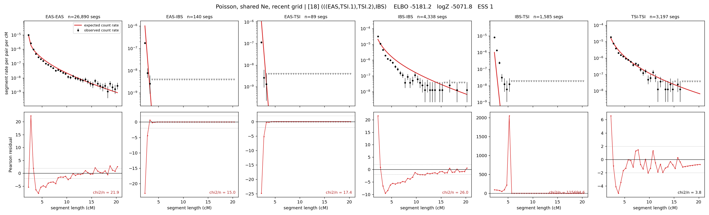

# `(((EAS,TSI.1),TSI.2),IBS)`

**Poisson, shared Ne, recent grid** | topology 18 of 21 | admixed leaf: **TSI** | 4 events, 8 nodes

> Recent Ne grid: 0-5 and 5-10 generations. The first demographic event is explicitly constrained to occur after generation 10 (minimum 11 with the current one-generation gap).

## Model score

| quantity | value | |
|---|---|---|
| ELBO | -5181.17 | +- 1.92 (MC) |
| logZ (importance sampling) | -5071.76 | |
| ESS of the IS weights | 1.0 / 4000 | LOW -- treat logZ with suspicion |
| Stan dropped-constant correction | -29.61 | already applied |
| seed kept / runtime | 13 | 22 s |

## Events (in temporal order, most recent first)

| # | type | detail | time (gen) | cumulative |
|---|---|---|---|---|
| 1 | ADMIXTURE | TSI -> TSI.1 + TSI.2 | 293.3 +- 0.8 | 293.3 |
| 2 | MERGE | TSI.2 + EAS -> n1 | 1.0 +- 0.0 | 294.3 |
| 3 | MERGE | TSI.1 + n1 -> n2 | 5.0 +- 0.1 | 299.3 |
| 4 | MERGE | n2 + IBS -> root | 1.0 +- 0.0 | 300.3 |

## Admixture fraction

**f = 1.000 +- 0.000** (fraction from `TSI.1`; 0.000 from `TSI.2`)

Collapsed to a tree: one source carries <5% of the ancestry, so this graph is behaving as its no-admixture special case.

## Recent effective sizes shared by IBD and SNP (haploid)

| population | 0-5 gen | 5-10 gen |
|---|---:|---:|
| `EAS` | 205,946,280 | 82,738,647 |
| `IBS` | 23,196,484 | 9,573,482 |
| `TSI` | 3,233,354 | 1,911,011 |

## Effective sizes shared by IBD and SNP (haploid)

| node | Ne | sd of log Ne |
|---|---|---|
| `EAS` | 1,578,649 | 0.03 |
| `IBS` | 223,414 | 0.04 |
| `TSI` | 301,688 | 0.09 |
| `TSI.1` | 187,637,133 | 0.15 |
| `TSI.2` | 28 | 0.06 |
| `n1` | 28 | 0.06 |
| `n2` | 4,552 | 0.08 |
| `root` | 908 | 0.07 |

log-Ne random-walk step scale tau = 2.598

## Fit quality by component

| component | log-likelihood | n terms | chi2/n |
|---|---|---|---|
| IBD | -4,615.6 | 222 | 19354.35 |
| SNP | -14.2 | 6 | 19.29 |

IBD chi2/n uses Poisson counting variance; SNP chi2/n uses its block SEs. Values near 1 indicate residuals on the modeled noise scale.

## SNP covariance residuals `(w_hat - W_pred)/w_se`

| | EAS | IBS | TSI |
|---|---|---|---|
| **EAS** | -0.03 | +0.36 | -0.31 |
| **IBS** | +0.36 | -0.34 | -0.38 |
| **TSI** | -0.31 | -0.38 | +0.95 |

