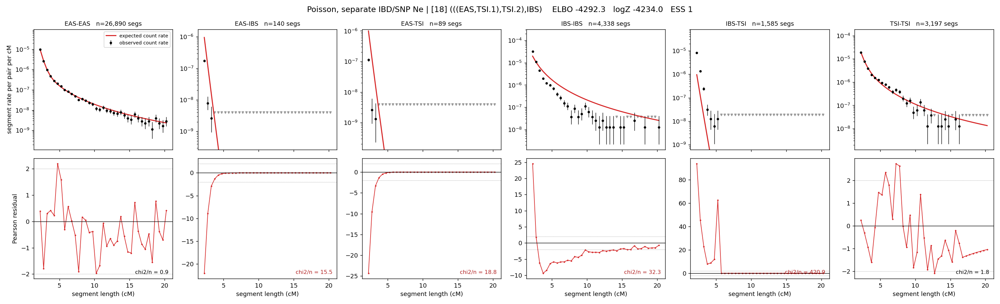

# `(((EAS,TSI.1),TSI.2),IBS)`

**Poisson, separate IBD/SNP Ne** | topology 18 of 21 | admixed leaf: **TSI** | 4 events, 8 nodes

## Model score

| quantity | value | |
|---|---|---|
| ELBO | -4292.26 | +- 0.78 (MC) |
| logZ (importance sampling) | -4234.00 | |
| ESS of the IS weights | 1.0 / 4000 | LOW -- treat logZ with suspicion |
| Stan dropped-constant correction | -29.78 | already applied |
| mode kept / MAP start / runtime | 1 / 7 | 18 s |
| mode search | 12/12 MAP starts succeeded | 3 distinct modes evaluated |

## Events (in temporal order, most recent first)

| # | type | detail | time (gen) | cumulative |
|---|---|---|---|---|
| 1 | ADMIXTURE | TSI -> TSI.1 + TSI.2 | 98.6 +- 6.4 | 98.6 |
| 2 | MERGE | TSI.2 + EAS -> n1 | 30.3 +- 3.7 | 129.0 |
| 3 | MERGE | TSI.1 + n1 -> n2 | 52.0 +- 4.7 | 180.9 |
| 4 | MERGE | n2 + IBS -> root | 1.2 +- 0.2 | 182.2 |

## Admixture fraction

**f = 0.999 +- 0.000** (fraction from `TSI.1`; 0.001 from `TSI.2`)

Collapsed to a tree: one source carries <5% of the ancestry, so this graph is behaving as its no-admixture special case.

## Effective sizes for IBD (haploid)

| node | Ne | sd of log Ne |
|---|---|---|
| `EAS` | 2,590,857 | 0.05 |
| `IBS` | 235,509 | 0.03 |
| `TSI` | 448,794 | 0.08 |
| `TSI.1` | 82,706 | 0.13 |
| `TSI.2` | 35,499 | 0.11 |
| `n1` | 39,736 | 0.12 |
| `n2` | 80,681 | 0.12 |
| `root` | 65,215 | 0.08 |

log-Ne random-walk step scale tau_ibd = 1.167

## Effective sizes for SNP (haploid)

| node | Ne | sd of log Ne |
|---|---|---|
| `EAS` | 723 | 0.03 |
| `IBS` | 143,944 | 0.18 |
| `TSI` | 155,322 | 0.14 |
| `TSI.1` | 90,863 | 0.14 |
| `TSI.2` | 28,758 | 0.34 |
| `n1` | 29,143 | 0.34 |
| `n2` | 37,261 | 0.19 |
| `root` | 37,358 | 0.19 |

log-Ne random-walk step scale tau_snp = 1.087

## Fit quality by component

| component | log-likelihood | n terms | chi2/n |
|---|---|---|---|
| IBD | -4,130.6 | 222 | 83.10 |
| SNP | +33.0 | 6 | 3.54 |

IBD chi2/n uses Poisson counting variance; SNP chi2/n uses its block SEs. Values near 1 indicate residuals on the modeled noise scale.

## SNP covariance residuals `(w_hat - W_pred)/w_se`

| | EAS | IBS | TSI |
|---|---|---|---|
| **EAS** | -0.01 | -0.03 | +0.05 |
| **IBS** | -0.03 | -0.18 | +0.27 |
| **TSI** | +0.05 | +0.27 | -0.35 |

