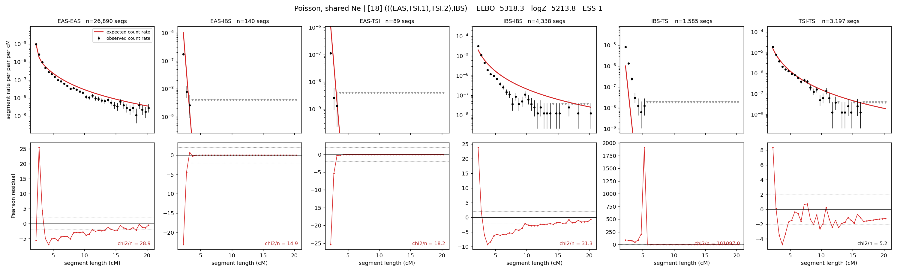

# `(((EAS,TSI.1),TSI.2),IBS)`

**Poisson, shared Ne** | topology 18 of 21 | admixed leaf: **TSI** | 4 events, 8 nodes

## Model score

| quantity | value | |
|---|---|---|
| ELBO | -5318.32 | +- 1.83 (MC) |
| logZ (importance sampling) | -5213.79 | |
| ESS of the IS weights | 1.2 / 4000 | LOW -- treat logZ with suspicion |
| Stan dropped-constant correction | -24.10 | already applied |
| seed kept / runtime | 13 | 16 s |

## Events (in temporal order, most recent first)

| # | type | detail | time (gen) | cumulative |
|---|---|---|---|---|
| 1 | ADMIXTURE | TSI -> TSI.1 + TSI.2 | 232.1 +- 7.2 | 232.1 |
| 2 | MERGE | TSI.2 + EAS -> n1 | 62.5 +- 7.3 | 294.6 |
| 3 | MERGE | TSI.1 + n1 -> n2 | 2.4 +- 0.3 | 297.0 |
| 4 | MERGE | n2 + IBS -> root | 1.0 +- 0.0 | 298.0 |

## Admixture fraction

**f = 1.000 +- 0.000** (fraction from `TSI.1`; 0.000 from `TSI.2`)

Collapsed to a tree: one source carries <5% of the ancestry, so this graph is behaving as its no-admixture special case.

## Effective sizes shared by IBD and SNP (haploid)

| node | Ne | sd of log Ne |
|---|---|---|
| `EAS` | 1,727,106 | 0.06 |
| `IBS` | 237,131 | 0.06 |
| `TSI` | 323,069 | 0.14 |
| `TSI.1` | 33,128,527,902,000 | 0.57 |
| `TSI.2` | 13 | 0.12 |
| `n1` | 13 | 0.11 |
| `n2` | 920 | 0.18 |
| `root` | 988 | 0.03 |

log-Ne random-walk step scale tau = 2.600

## Fit quality by component

| component | log-likelihood | n terms | chi2/n |
|---|---|---|---|
| IBD | -4,952.8 | 222 | 16925.33 |
| SNP | +5.2 | 6 | 12.80 |

IBD chi2/n uses Poisson counting variance; SNP chi2/n uses its block SEs. Values near 1 indicate residuals on the modeled noise scale.

## SNP covariance residuals `(w_hat - W_pred)/w_se`

| | EAS | IBS | TSI |
|---|---|---|---|
| **EAS** | +0.20 | +0.66 | -1.06 |
| **IBS** | +0.66 | -1.99 | +0.79 |
| **TSI** | -1.06 | +0.79 | +1.27 |

