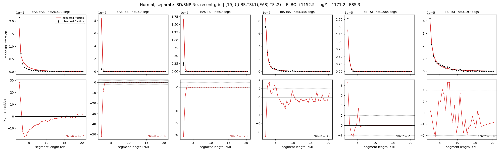

# `(((IBS,TSI.1),EAS),TSI.2)`

**Normal, separate IBD/SNP Ne, recent grid** | topology 19 of 21 | admixed leaf: **TSI** | 4 events, 8 nodes

> Recent Ne grid: 0-5 and 5-10 generations. The first demographic event is explicitly constrained to occur after generation 10 (minimum 11 with the current one-generation gap).

## Model score

| quantity | value | |
|---|---|---|
| ELBO | +1152.52 | +- 0.22 (MC) |
| logZ (importance sampling) | +1171.22 | |
| ESS of the IS weights | 3.2 / 4000 | LOW -- treat logZ with suspicion |
| Stan dropped-constant correction | -40.81 | already applied |
| mode kept / MAP start / runtime | 1 / 3 | 26 s |
| mode search | 12/12 MAP starts succeeded | 3 distinct modes evaluated |

## Events (in temporal order, most recent first)

| # | type | detail | time (gen) | cumulative |
|---|---|---|---|---|
| 1 | ADMIXTURE | TSI -> TSI.1 + TSI.2 | 107.0 +- 0.6 | 107.0 |
| 2 | MERGE | TSI.2 + IBS -> n1 | 12.0 +- 0.0 | 119.0 |
| 3 | MERGE | n1 + EAS -> n2 | 227.9 +- 1.6 | 346.9 |
| 4 | MERGE | TSI.1 + n2 -> root | 163.0 +- 0.9 | 509.9 |

## Admixture fraction

**f = 0.801 +- 0.002** (fraction from `TSI.1`; 0.199 from `TSI.2`)

## Recent effective sizes for IBD (haploid)

| population | 0-5 gen | 5-10 gen |
|---|---:|---:|
| `EAS` | 31,764,358 | 19,599,354 |
| `IBS` | 1,797,886 | 1,468,513 |
| `TSI` | 1,046,350 | 717,776 |

## Effective sizes for IBD (haploid)

| node | Ne | sd of log Ne |
|---|---|---|
| `EAS` | 1,104,712 | 0.03 |
| `IBS` | 646,376 | 0.05 |
| `TSI` | 407,403 | 0.04 |
| `TSI.1` | 56,402 | 0.02 |
| `TSI.2` | 21,148 | 0.02 |
| `n1` | 16,613 | 0.02 |
| `n2` | 17 | 0.04 |
| `root` | 13,021 | 0.00 |

log-Ne random-walk step scale tau_ibd = 2.270

## Recent effective sizes for SNP (haploid)

| population | 0-5 gen | 5-10 gen |
|---|---:|---:|
| `EAS` | 2,024 | 1,785 |
| `IBS` | 448,138 | 444,460 |
| `TSI` | 830,372 | 919,147 |

## Effective sizes for SNP (haploid)

| node | Ne | sd of log Ne |
|---|---|---|
| `EAS` | 1,927 | 0.01 |
| `IBS` | 375,862 | 0.04 |
| `TSI` | 978,934 | 0.03 |
| `TSI.1` | 635,511 | 0.03 |
| `TSI.2` | 257,275 | 0.04 |
| `n1` | 238,403 | 0.04 |
| `n2` | 75,306 | 0.01 |
| `root` | 24,858 | 0.01 |

log-Ne random-walk step scale tau_snp = 0.848

## Fit quality by component

| component | log-likelihood | n terms | chi2/n |
|---|---|---|---|
| IBD | +1,404.6 | 222 | 26.52 |
| SNP | +42.1 | 6 | 0.50 |

IBD chi2/n uses Palamara model-derived Normal variance; SNP chi2/n uses its block SEs. Values near 1 indicate residuals on the modeled noise scale.

## SNP covariance residuals `(w_hat - W_pred)/w_se`

| | EAS | IBS | TSI |
|---|---|---|---|
| **EAS** | +0.05 | -0.31 | +0.22 |
| **IBS** | -0.31 | +0.37 | +0.23 |
| **TSI** | +0.22 | +0.23 | -0.63 |

