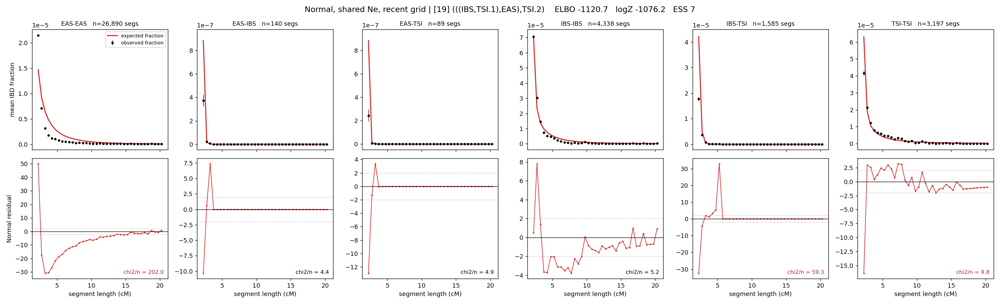

# `(((IBS,TSI.1),EAS),TSI.2)`

**Normal, shared Ne, recent grid** | topology 19 of 21 | admixed leaf: **TSI** | 4 events, 8 nodes

> Recent Ne grid: 0-5 and 5-10 generations. The first demographic event is explicitly constrained to occur after generation 10 (minimum 11 with the current one-generation gap).

## Model score

| quantity | value | |
|---|---|---|
| ELBO | -1120.75 | +- 0.81 (MC) |
| logZ (importance sampling) | -1076.17 | |
| ESS of the IS weights | 6.6 / 4000 | LOW -- treat logZ with suspicion |
| Stan dropped-constant correction | -29.61 | already applied |
| mode kept / MAP start / runtime | 3 / 0 | 27 s |
| mode search | 12/12 MAP starts succeeded | 3 distinct modes evaluated |

## Events (in temporal order, most recent first)

| # | type | detail | time (gen) | cumulative |
|---|---|---|---|---|
| 1 | ADMIXTURE | TSI -> TSI.1 + TSI.2 | 11.2 +- 0.0 | 11.2 |
| 2 | MERGE | TSI.2 + IBS -> n1 | 200.0 +- 0.5 | 211.2 |
| 3 | MERGE | n1 + EAS -> n2 | 208.3 +- 1.3 | 419.5 |
| 4 | MERGE | TSI.1 + n2 -> root | 312.6 +- 0.3 | 732.1 |

## Admixture fraction

**f = 0.000 +- 0.000** (fraction from `TSI.1`; 1.000 from `TSI.2`)

Collapsed to a tree: one source carries <5% of the ancestry, so this graph is behaving as its no-admixture special case.

## Recent effective sizes shared by IBD and SNP (haploid)

| population | 0-5 gen | 5-10 gen |
|---|---:|---:|
| `EAS` | 68,617,716 | 34,370,236 |
| `IBS` | 4,979,347 | 3,024,301 |
| `TSI` | 549,387 | 475,304 |

## Effective sizes shared by IBD and SNP (haploid)

| node | Ne | sd of log Ne |
|---|---|---|
| `EAS` | 718,429 | 0.04 |
| `IBS` | 356,463 | 0.06 |
| `TSI` | 585,091 | 0.05 |
| `TSI.1` | 59,217,687 | 0.07 |
| `TSI.2` | 475,342 | 0.05 |
| `n1` | 1,169 | 0.02 |
| `n2` | 0 | 0.06 |
| `root` | 12,240 | 0.00 |

log-Ne random-walk step scale tau = 2.678

## Fit quality by component

| component | log-likelihood | n terms | chi2/n |
|---|---|---|---|
| IBD | -894.3 | 222 | 47.84 |
| SNP | +14.0 | 6 | 9.87 |

IBD chi2/n uses Palamara model-derived Normal variance; SNP chi2/n uses its block SEs. Values near 1 indicate residuals on the modeled noise scale.

## SNP covariance residuals `(w_hat - W_pred)/w_se`

| | EAS | IBS | TSI |
|---|---|---|---|
| **EAS** | +1.29 | -1.14 | -1.42 |
| **IBS** | -1.14 | +3.29 | -1.20 |
| **TSI** | -1.42 | -1.20 | +3.82 |

