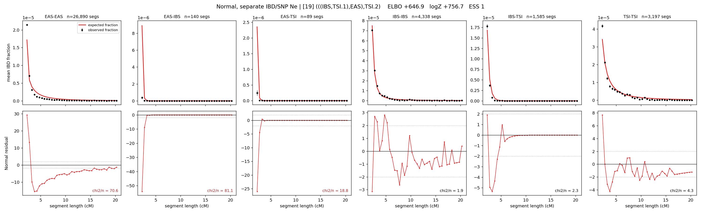

# `(((IBS,TSI.1),EAS),TSI.2)`

**Normal, separate IBD/SNP Ne** | topology 19 of 21 | admixed leaf: **TSI** | 4 events, 8 nodes

## Model score

| quantity | value | |
|---|---|---|
| ELBO | +646.93 | +- 1.70 (MC) |
| logZ (importance sampling) | +756.68 | |
| ESS of the IS weights | 1.0 / 4000 | LOW -- treat logZ with suspicion |
| Stan dropped-constant correction | -29.78 | already applied |
| seed kept / runtime | 7 | 18 s |

## Events (in temporal order, most recent first)

| # | type | detail | time (gen) | cumulative |
|---|---|---|---|---|
| 1 | ADMIXTURE | TSI -> TSI.1 + TSI.2 | 2.8 +- 0.0 | 2.8 |
| 2 | MERGE | TSI.2 + IBS -> n1 | 95.5 +- 4.1 | 98.2 |
| 3 | MERGE | n1 + EAS -> n2 | 257.3 +- 3.7 | 355.6 |
| 4 | MERGE | TSI.1 + n2 -> root | 501.5 +- 9.7 | 857.1 |

## Admixture fraction

**f = 0.735 +- 0.018** (fraction from `TSI.1`; 0.265 from `TSI.2`)

## Effective sizes for IBD (haploid)

| node | Ne | sd of log Ne |
|---|---|---|
| `EAS` | 1,210,763 | 0.07 |
| `IBS` | 743,133 | 0.19 |
| `TSI` | 284,503 | 0.04 |
| `TSI.1` | 185,867 | 0.06 |
| `TSI.2` | 979,922 | 0.08 |
| `n1` | 35,281 | 0.19 |
| `n2` | 3 | 0.53 |
| `root` | 20,360 | 0.01 |

log-Ne random-walk step scale tau_ibd = 1.402

## Effective sizes for SNP (haploid)

| node | Ne | sd of log Ne |
|---|---|---|
| `EAS` | 1,966 | 0.02 |
| `IBS` | 66,018,639 | 0.62 |
| `TSI` | 2,011,605 | 0.36 |
| `TSI.1` | 782,242 | 0.36 |
| `TSI.2` | 31,522,568 | 0.58 |
| `n1` | 5,032,396 | 0.45 |
| `n2` | 332,366 | 0.32 |
| `root` | 219,197 | 0.19 |

log-Ne random-walk step scale tau_snp = 0.544

## Fit quality by component

| component | log-likelihood | n terms | chi2/n |
|---|---|---|---|
| IBD | +899.5 | 222 | 30.58 |
| SNP | +23.7 | 6 | 6.64 |

IBD chi2/n uses Palamara model-derived Normal variance; SNP chi2/n uses its block SEs. Values near 1 indicate residuals on the modeled noise scale.

## SNP covariance residuals `(w_hat - W_pred)/w_se`

| | EAS | IBS | TSI |
|---|---|---|---|
| **EAS** | -0.15 | -0.51 | +0.81 |
| **IBS** | -0.51 | +2.65 | -1.80 |
| **TSI** | +0.81 | -1.80 | +0.15 |

