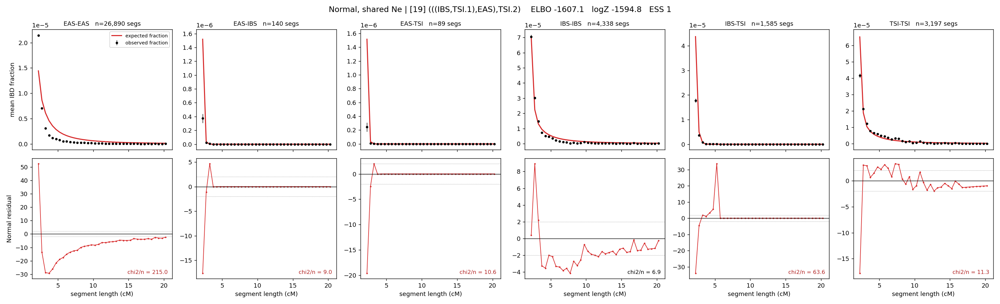

# `(((IBS,TSI.1),EAS),TSI.2)`

**Normal, shared Ne** | topology 19 of 21 | admixed leaf: **TSI** | 4 events, 8 nodes

## Model score

| quantity | value | |
|---|---|---|
| ELBO | -1607.06 | +- 0.14 (MC) |
| logZ (importance sampling) | -1594.83 | |
| ESS of the IS weights | 1.3 / 4000 | LOW -- treat logZ with suspicion |
| Stan dropped-constant correction | -24.10 | already applied |
| mode kept / MAP start / runtime | 1 / 3 | 19 s |
| mode search | 12/12 MAP starts succeeded | 3 distinct modes evaluated |

## Events (in temporal order, most recent first)

| # | type | detail | time (gen) | cumulative |
|---|---|---|---|---|
| 1 | ADMIXTURE | TSI -> TSI.1 + TSI.2 | 205.8 +- 0.3 | 205.8 |
| 2 | MERGE | TSI.2 + IBS -> n1 | 6.7 +- 0.0 | 212.5 |
| 3 | MERGE | n1 + EAS -> n2 | 192.4 +- 0.1 | 404.9 |
| 4 | MERGE | TSI.1 + n2 -> root | 416.2 +- 0.5 | 821.1 |

## Admixture fraction

**f = 0.001 +- 0.000** (fraction from `TSI.1`; 0.999 from `TSI.2`)

Collapsed to a tree: one source carries <5% of the ancestry, so this graph is behaving as its no-admixture special case.

## Effective sizes shared by IBD and SNP (haploid)

| node | Ne | sd of log Ne |
|---|---|---|
| `EAS` | 774,256 | 0.01 |
| `IBS` | 381,202 | 0.04 |
| `TSI` | 485,775 | 0.04 |
| `TSI.1` | 42,319 | 0.02 |
| `TSI.2` | 10,354 | 0.01 |
| `n1` | 1,085 | 0.01 |
| `n2` | 1 | 0.01 |
| `root` | 17,479 | 0.00 |

log-Ne random-walk step scale tau = 2.231

## Fit quality by component

| component | log-likelihood | n terms | chi2/n |
|---|---|---|---|
| IBD | -1,465.0 | 222 | 52.78 |
| SNP | +29.7 | 6 | 4.65 |

IBD chi2/n uses Palamara model-derived Normal variance; SNP chi2/n uses its block SEs. Values near 1 indicate residuals on the modeled noise scale.

## SNP covariance residuals `(w_hat - W_pred)/w_se`

| | EAS | IBS | TSI |
|---|---|---|---|
| **EAS** | +1.73 | -2.25 | -1.15 |
| **IBS** | -2.25 | +2.41 | +2.02 |
| **TSI** | -1.15 | +2.02 | +0.30 |

