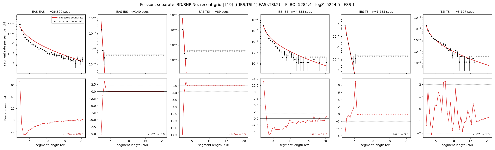

# `(((IBS,TSI.1),EAS),TSI.2)`

**Poisson, separate IBD/SNP Ne, recent grid** | topology 19 of 21 | admixed leaf: **TSI** | 4 events, 8 nodes

> Recent Ne grid: 0-5 and 5-10 generations. The first demographic event is explicitly constrained to occur after generation 10 (minimum 11 with the current one-generation gap).

## Model score

| quantity | value | |
|---|---|---|
| ELBO | -5284.37 | +- 1.03 (MC) |
| logZ (importance sampling) | -5224.50 | |
| ESS of the IS weights | 1.1 / 4000 | LOW -- treat logZ with suspicion |
| Stan dropped-constant correction | -40.81 | already applied |
| seed kept / runtime | 7 | 23 s |

## Events (in temporal order, most recent first)

| # | type | detail | time (gen) | cumulative |
|---|---|---|---|---|
| 1 | ADMIXTURE | TSI -> TSI.1 + TSI.2 | 11.0 +- 0.0 | 11.0 |
| 2 | MERGE | TSI.2 + IBS -> n1 | 144.3 +- 0.5 | 155.3 |
| 3 | MERGE | n1 + EAS -> n2 | 203.7 +- 2.7 | 359.0 |
| 4 | MERGE | TSI.1 + n2 -> root | 1.0 +- 0.0 | 360.0 |

## Admixture fraction

**f = 0.011 +- 0.000** (fraction from `TSI.1`; 0.989 from `TSI.2`)

Collapsed to a tree: one source carries <5% of the ancestry, so this graph is behaving as its no-admixture special case.

## Recent effective sizes for IBD (haploid)

| population | 0-5 gen | 5-10 gen |
|---|---:|---:|
| `EAS` | 44,275,387 | 27,277,610 |
| `IBS` | 4,837,639 | 3,140,815 |
| `TSI` | 2,546,611 | 1,776,681 |

## Effective sizes for IBD (haploid)

| node | Ne | sd of log Ne |
|---|---|---|
| `EAS` | 835,075 | 0.04 |
| `IBS` | 296,342 | 0.09 |
| `TSI` | 765,305 | 0.12 |
| `TSI.1` | 71 | 0.14 |
| `TSI.2` | 711,408 | 0.11 |
| `n1` | 16,657 | 0.05 |
| `n2` | 161 | 0.07 |
| `root` | 153 | 0.07 |

log-Ne random-walk step scale tau_ibd = 2.489

## Recent effective sizes for SNP (haploid)

| population | 0-5 gen | 5-10 gen |
|---|---:|---:|
| `EAS` | 2,363 | 2,342 |
| `IBS` | 143,948 | 142,757 |
| `TSI` | 104,310 | 103,777 |

## Effective sizes for SNP (haploid)

| node | Ne | sd of log Ne |
|---|---|---|
| `EAS` | 2,236 | 0.01 |
| `IBS` | 137,331 | 0.04 |
| `TSI` | 102,653 | 0.03 |
| `TSI.1` | 16,115 | 0.01 |
| `TSI.2` | 104,155 | 0.03 |
| `n1` | 10,044 | 0.01 |
| `n2` | 15,137 | 0.00 |
| `root` | 15,257 | 0.00 |

log-Ne random-walk step scale tau_snp = 0.859

## Fit quality by component

| component | log-likelihood | n terms | chi2/n |
|---|---|---|---|
| IBD | -4,985.5 | 222 | 40.76 |
| SNP | +35.1 | 6 | 2.82 |

IBD chi2/n uses Poisson counting variance; SNP chi2/n uses its block SEs. Values near 1 indicate residuals on the modeled noise scale.

## SNP covariance residuals `(w_hat - W_pred)/w_se`

| | EAS | IBS | TSI |
|---|---|---|---|
| **EAS** | +0.03 | +0.09 | -0.16 |
| **IBS** | +0.09 | -0.04 | -0.14 |
| **TSI** | -0.16 | -0.14 | +0.43 |

