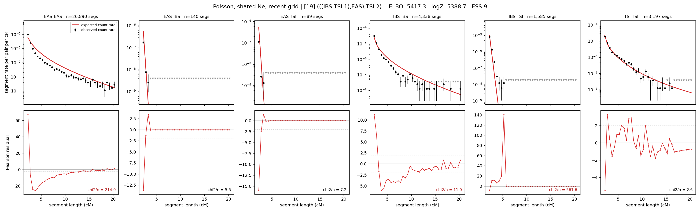

# `(((IBS,TSI.1),EAS),TSI.2)`

**Poisson, shared Ne, recent grid** | topology 19 of 21 | admixed leaf: **TSI** | 4 events, 8 nodes

> Recent Ne grid: 0-5 and 5-10 generations. The first demographic event is explicitly constrained to occur after generation 10 (minimum 11 with the current one-generation gap).

## Model score

| quantity | value | |
|---|---|---|
| ELBO | -5417.26 | +- 0.55 (MC) |
| logZ (importance sampling) | -5388.68 | |
| ESS of the IS weights | 9.3 / 4000 | LOW -- treat logZ with suspicion |
| Stan dropped-constant correction | -29.61 | already applied |
| seed kept / runtime | 13 | 22 s |

## Events (in temporal order, most recent first)

| # | type | detail | time (gen) | cumulative |
|---|---|---|---|---|
| 1 | ADMIXTURE | TSI -> TSI.1 + TSI.2 | 11.0 +- 0.0 | 11.0 |
| 2 | MERGE | TSI.2 + IBS -> n1 | 238.4 +- 0.7 | 249.4 |
| 3 | MERGE | n1 + EAS -> n2 | 101.4 +- 0.5 | 350.8 |
| 4 | MERGE | TSI.1 + n2 -> root | 1.0 +- 0.0 | 351.8 |

## Admixture fraction

**f = 0.000 +- 0.000** (fraction from `TSI.1`; 1.000 from `TSI.2`)

Collapsed to a tree: one source carries <5% of the ancestry, so this graph is behaving as its no-admixture special case.

## Recent effective sizes shared by IBD and SNP (haploid)

| population | 0-5 gen | 5-10 gen |
|---|---:|---:|
| `EAS` | 123,607,209 | 56,580,137 |
| `IBS` | 11,255,333 | 6,137,206 |
| `TSI` | 1,685,944 | 1,240,073 |

## Effective sizes shared by IBD and SNP (haploid)

| node | Ne | sd of log Ne |
|---|---|---|
| `EAS` | 830,072 | 0.02 |
| `IBS` | 291,618 | 0.03 |
| `TSI` | 643,107 | 0.09 |
| `TSI.1` | 20,680 | 0.05 |
| `TSI.2` | 394,821 | 0.09 |
| `n1` | 562 | 0.01 |
| `n2` | 253 | 0.01 |
| `root` | 247 | 0.01 |

log-Ne random-walk step scale tau = 2.878

## Fit quality by component

| component | log-likelihood | n terms | chi2/n |
|---|---|---|---|
| IBD | -5,078.5 | 222 | 134.22 |
| SNP | +29.6 | 6 | 4.66 |

IBD chi2/n uses Poisson counting variance; SNP chi2/n uses its block SEs. Values near 1 indicate residuals on the modeled noise scale.

## SNP covariance residuals `(w_hat - W_pred)/w_se`

| | EAS | IBS | TSI |
|---|---|---|---|
| **EAS** | -0.16 | +0.32 | -0.00 |
| **IBS** | +0.32 | +1.29 | -2.04 |
| **TSI** | -0.00 | -2.04 | +1.92 |

