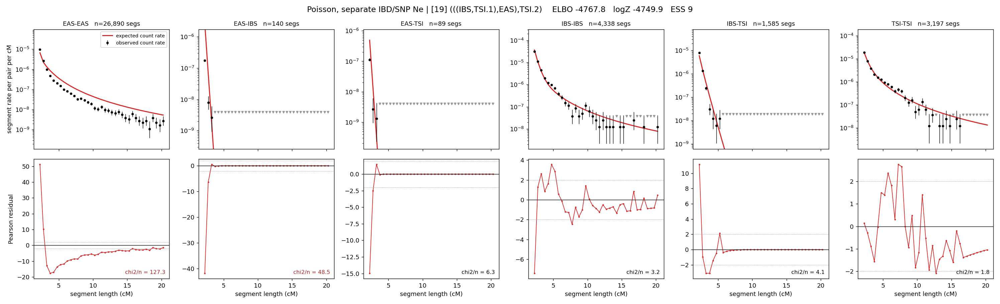

# `(((IBS,TSI.1),EAS),TSI.2)`

**Poisson, separate IBD/SNP Ne** | topology 19 of 21 | admixed leaf: **TSI** | 4 events, 8 nodes

## Model score

| quantity | value | |
|---|---|---|
| ELBO | -4767.82 | +- 0.22 (MC) |
| logZ (importance sampling) | -4749.90 | |
| ESS of the IS weights | 9.4 / 4000 | LOW -- treat logZ with suspicion |
| Stan dropped-constant correction | -29.78 | already applied |
| mode kept / MAP start / runtime | 1 / 11 | 19 s |
| mode search | 12/12 MAP starts succeeded | 3 distinct modes evaluated |

## Events (in temporal order, most recent first)

| # | type | detail | time (gen) | cumulative |
|---|---|---|---|---|
| 1 | ADMIXTURE | TSI -> TSI.1 + TSI.2 | 98.5 +- 0.6 | 98.5 |
| 2 | MERGE | TSI.2 + IBS -> n1 | 8.2 +- 0.1 | 106.7 |
| 3 | MERGE | n1 + EAS -> n2 | 245.9 +- 1.3 | 352.6 |
| 4 | MERGE | TSI.1 + n2 -> root | 186.2 +- 0.6 | 538.8 |

## Admixture fraction

**f = 0.813 +- 0.002** (fraction from `TSI.1`; 0.187 from `TSI.2`)

## Effective sizes for IBD (haploid)

| node | Ne | sd of log Ne |
|---|---|---|
| `EAS` | 1,118,498 | 0.03 |
| `IBS` | 771,310 | 0.05 |
| `TSI` | 447,504 | 0.04 |
| `TSI.1` | 60,017 | 0.03 |
| `TSI.2` | 78,795 | 0.03 |
| `n1` | 23,003 | 0.02 |
| `n2` | 26 | 0.10 |
| `root` | 6,410 | 0.03 |

log-Ne random-walk step scale tau_ibd = 1.682

## Effective sizes for SNP (haploid)

| node | Ne | sd of log Ne |
|---|---|---|
| `EAS` | 1,958 | 0.01 |
| `IBS` | 277,245 | 0.04 |
| `TSI` | 900,504 | 0.06 |
| `TSI.1` | 1,131,628 | 0.07 |
| `TSI.2` | 218,186 | 0.04 |
| `n1` | 229,456 | 0.04 |
| `n2` | 89,366 | 0.02 |
| `root` | 62,440 | 0.04 |

log-Ne random-walk step scale tau_snp = 0.831

## Fit quality by component

| component | log-likelihood | n terms | chi2/n |
|---|---|---|---|
| IBD | -4,597.3 | 222 | 31.97 |
| SNP | +38.6 | 6 | 1.67 |

IBD chi2/n uses Poisson counting variance; SNP chi2/n uses its block SEs. Values near 1 indicate residuals on the modeled noise scale.

## SNP covariance residuals `(w_hat - W_pred)/w_se`

| | EAS | IBS | TSI |
|---|---|---|---|
| **EAS** | +0.03 | -0.12 | +0.07 |
| **IBS** | -0.12 | +0.03 | +0.21 |
| **TSI** | +0.07 | +0.21 | -0.33 |

